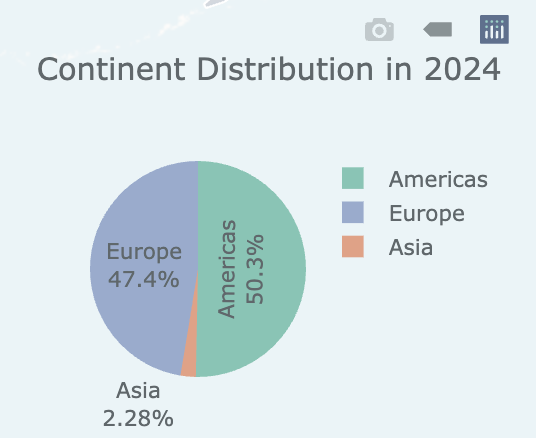
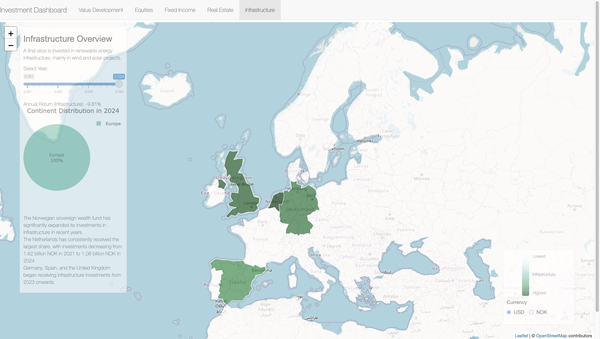

```{r setup, include=FALSE}
knitr::opts_chunk$set(
  warning = FALSE,  
  message = FALSE 
 # results = 'hide' 
)
```

# Background

## About the Norwegian Pension Fund

Norway’s pension system is globally recognized for its sustainability,
transparency, and fiscal discipline. At its core lies the Government
Pension Fund Global (GPFG)—commonly referred to as the Norwegian Oil
Fund—which is the largest sovereign wealth fund (SWF) in the world, with
assets exceeding \$1.5 trillion USD.

Established in the 1990s to manage the country’s oil revenues, the fund
operates under a long-term investment strategy designed to ensure that
current and future generations benefit equally from Norway’s petroleum
wealth. Managed by Norges Bank Investment Management (NBIM), the fund is
invested globally across equities, fixed income, and real estate, and
its returns form a key pillar of the Norwegian welfare state.

<div style="text-align: center;">
   
</div>

## 🧭 Research Motivation

Sovereign wealth funds represent a unique class of institutional
investors: while they resemble mutual funds and pension funds in their
diversified investment strategies, they also carry macroeconomic,
geopolitical, and policy-making implications. Among them, Norway’s GPFG
stands out as a model of fiscal prudence and ethical investment
governance.

Our research is motivated by several key factors:

1.  Growing global attention on SWFs: In an era marked by rising
    economic nationalism and geopolitical tensions—from the Trump-era
    tariff wars to ongoing resource competition—sovereign funds have
    become increasingly relevant strategic actors in global finance.

2.  NBIM as a policy and performance benchmark: As the world's largest
    SWF, GPFG sets global standards for transparency, ESG investment,
    and long-term capital stewardship.

3.  Academic interest in bridging finance and public economics: Unlike
    private financial instruments, sovereign funds directly interface
    with national fiscal policies, intergenerational equity, and global
    political dynamics.

Through this lens, Norway's pension model offers a rare opportunity to
study the intersection of state power, financial strategy, and social
contract.

# Data Sources

## Data Introduction

This study is based on official data from the Norwegian Government
Pension Fund Global (GPFG), managed by Norges Bank Investment Management
(NBIM). The fund aims to ensure long-term value creation for future
generations in Norway by maintaining a globally diversified portfolio.
The analysis uses annual investment records from 1998 to 2024, covering
the fund’s major asset classes. Key data characteristics and current
portfolio composition are outlined as follows:

-   **Equities(eq)**

Equities represent ownership in more than 8,500 companies across global
markets. As of the latest reporting period, they constitute 71.4% of the
fund’s total investments, equivalent to approximately 14,113 billion
kroner. Equity data include market values and sector-level exposures by
country and year. This asset class provides the fund with long-term
growth potential and broad economic participation.

-   **Fixed Income(fi)**

This category consists primarily of government and corporate bonds,
contributing 26.6% of the fund’s portfolio, or about 5,253 billion
kroner. Fixed income assets offer income stability and diversification
benefits, particularly during periods of equity market volatility. The
data include issuer types, maturity profiles, and currency allocations.

-   **Real Estate(re)**

The fund’s real estate investments focus on unlisted office buildings,
logistics centers, and retail properties located in key international
cities. This asset class accounts for 1.8% of total holdings, with a
valuation of 364 billion kroner. Real estate exposure data include
regional allocations, asset categories, and valuation metrics.

-   **Infrastructure(inf)**

Infrastructure investments are concentrated in renewable energy
projects, such as onshore wind and solar power. Although relatively new,
this category now represents 0.1% of the portfolio, valued at 25 billion
kroner. These investments align with the fund’s broader goals of
sustainability and long-term resilience. The infrastructure dataset
covers project types, energy sources, and investment geography.

All datasets used in this study are obtained from NBIM’s publicly
available annual disclosures. Each file contains standardized,
machine-readable tables covering country or issuer-level detail across
market value, currency, and sector. These files can be batch downloaded
via uniform resource links for consistent and replicable analysis.

## Data Pre-processing

To prepare the data for analysis, we developed a general-purpose
**preprocessing function** (`process_nbim_data`) which: - Downloads the
raw Excel files for a specified asset class and time range\
- Extracts relevant fields such as market value, country, and year\
- Aggregates the data to compute the **total investment value per
country per year**\
- Outputs a clean and consistent CSV summary table

This function ensures comparability across asset classes and time
periods, and enables further analysis such as cross-country comparisons
and time series trends.

```{r eval=FALSE}
library(httr)
library(readxl)
library(readr)
library(dplyr)
library(tidyr)

process_nbim_data <- function(category,
                              currency = "NOK",
                              years = 2001:2024,
                              output_dir = "nbim_data",
                              group_by_level = "country") {

  currency <- toupper(currency)
  group_by_level <- tolower(group_by_level)

  if (!currency %in% c("NOK", "USD")) {
    stop("Currency must be either 'NOK' or 'USD'")
  }

  if (!group_by_level %in% c("country", "industry")) {
    stop("group_by_level must be either 'country' or 'industry'")
  }

  dir.create(output_dir, showWarnings = FALSE)
  data_list <- list()

  for (year in years) {
    cat("Processing", category, year, "...\n")
    url <- paste0("https://www.nbim.no/hr/report/?category=", category, "&sortby=country&filetype=xlsx&year=", year)
    destfile <- file.path(output_dir, paste0(category, "_", year, ".xlsx"))

    tryCatch({
      response <- GET(url, write_disk(destfile, overwrite = TRUE))
      if (response$status_code != 200) {
        cat("Failed to download year", year, "\n")
        next
      }
    }, error = function(e) {
      cat("Error downloading", year, "\n")
      next
    })

    df <- tryCatch({
      read_excel(destfile, sheet = excel_sheets(destfile)[1])
    }, error = function(e) {
      cat("Error reading Excel for", year, "\n")
      return(NULL)
    })

    if (!is.null(df)) {
      df$Year <- year
      data_list[[as.character(year)]] <- df
    }
  }

  combined <- bind_rows(data_list)

  if (category %in% c("eq", "fi")) {
    value_col <- ifelse(currency == "NOK", "Market Value(NOK)", "Market Value(USD)")
    group_col <- ifelse(group_by_level == "industry", "Industry", "Country")

    if (!value_col %in% names(combined)) {
      stop(paste("Column", value_col, "not found in data"))
    }
    if (!group_col %in% names(combined)) {
      stop(paste("Grouping column", group_col, "not found in data"))
    }

    combined <- combined %>%
      mutate(
        !!value_col := as.numeric(.data[[value_col]]),
        Year = as.integer(Year)
      ) %>%
      filter(!is.na(.data[[value_col]]), !is.na(.data[[group_col]]), !is.na(Year)) %>%
      group_by(.data[[group_col]], Year) %>%
      summarise(`Total Market Value` = sum(.data[[value_col]], na.rm = TRUE), .groups = "drop") %>%
      rename(Group = 1) %>%
      pivot_wider(names_from = Year, values_from = `Total Market Value`, names_sort = TRUE)

    combined[is.na(combined)] <- 0
    output_file <- file.path(output_dir, paste0(category, "_by_", group_by_level, "(", currency, ").csv"))

  } else if (category %in% c("re", "inf")) {
    value_col <- ifelse(currency == "NOK", "Total country value", "Total country value (USD)")

    if (!value_col %in% names(combined)) {
      stop(paste("Column", value_col, "not found in data"))
    }

    combined <- combined %>%
      mutate(
        !!value_col := as.numeric(gsub(",", "", .data[[value_col]])),
        Year = as.integer(Year)
      ) %>%
      filter(!is.na(.data[[value_col]]), !is.na(Country), !is.na(Year)) %>%
      group_by(Country, Year) %>%
      summarise(`Total Market Value` = sum(.data[[value_col]], na.rm = TRUE), .groups = "drop") %>%
      rename(Group = Country) %>%
      pivot_wider(names_from = Year, values_from = `Total Market Value`, names_sort = TRUE)

    combined[is.na(combined)] <- 0
    output_file <- file.path(output_dir, paste0(category, "_by_country(", currency, ").csv"))
  } else {
    stop("Unsupported category: must be one of 'eq', 'fi', 're', 'inf'")
  }

  write.csv(combined, output_file, row.names = FALSE)
  cat("✅ Finished processing", category, "in", currency, "grouped by", group_by_level, "and saved to", output_file, "\n")

  return(combined)
}


```

Then we can easily get the summary imformation by using this function.
The following is a sample to get the equities ivestment summary.

```{r eval=FALSE }
equities_summary <- process_nbim_data(
  category = "fi", # 
  years = 1998:2024,
  output_dir = "nbim_data",
  currency = "USD",
  group_by_level = "Industry"
)
```

-   Statistics Norway (SSB)\
-   OECD Pension Database\
-   Norwegian Labour and Welfare Administration (NAV)\
-   Other academic and policy sources

# Equity Investment Analysis

## Equity Investment by Country

### Country Share Over Time

The stacked area chart below illustrates the Norwegian Pension Fund's
annual equity investment share across its top invested countries,
including China. By visualizing the capital allocation from year to
year, we can observe clear trends such as increasing concentration in
specific countries and shifts in geographic investment priorities. This
provides a comprehensive view of how the fund’s international exposure
has evolved over time.

```{r}
library(tidyverse)
library(scales)
library(readr)

equities <- read_csv("nbim_data/eq_by_country(USD).csv")
```

```{r}
equities_long <- equities %>%
  pivot_longer(-Country, names_to = "Year", values_to = "Investment") %>%
  mutate(Year = as.integer(Year)) %>%
  filter(!is.na(Investment))


equities_long$Investment[is.na(equities_long$Investment)] <- 0

total_investment_per_year <- equities_long %>%
  group_by(Year) %>%
  summarise(Total = sum(Investment))

equities_share <- equities_long %>%
  left_join(total_investment_per_year, by = "Year") %>%
  mutate(Share = Investment / Total)
# 1️⃣ Visualization: Yearly Investment Share for Top Countries + China
top_countries <- equities_long %>%
  group_by(Country) %>%
  summarise(TotalInvestment = sum(Investment)) %>%
  top_n(6, TotalInvestment) %>%
  pull(Country)

# Ensure China is included
top_countries <- union(top_countries, "China")

library(RColorBrewer)

pastel_colors <- brewer.pal(n = 8, name = "Set2")

ggplot(
  equities_share %>% filter(Country %in% top_countries),
  aes(x = Year, y = Share, fill = Country)
) +
  geom_area(alpha = 0.9, color = "white", size = 0.3) +
  scale_fill_manual(values = pastel_colors) +
  scale_y_continuous(labels = percent_format()) +
  labs(
    title = "Norwegian Pension Fund Equity Investment – Country Share Over Time",
    y = "Investment Share",
    x = "Year"
  ) +
  theme_minimal(base_family = "Arial") +
  theme(
    plot.title = element_text(face = "bold", size = 16, color = "#333333"),
    axis.title = element_text(size = 12, color = "#444444"),
    axis.text = element_text(color = "#666666"),
    legend.position = "bottom",
    legend.title = element_blank(),
    panel.grid.major.x = element_blank(),
    panel.grid.minor = element_blank()
  )
```

### Investment Concentration: Herfindahl-Hirschman Index (HHI)

The Herfindahl-Hirschman Index (HHI) is a well-established measure of
portfolio concentration. It is computed as the sum of the squares of
each country’s investment share in a given year: $$
    \mathrm{HHI} = \sum_{i=1}^{n} s_i^2
    $$ where \$ s_i \$ is the proportion of the total investment
allocated to country \$ i \$ in a specific year. An HHI value closer to
1 indicates a highly concentrated investment portfolio (i.e., focused in
a few countries), while a value closer to 0 indicates a more diversified
allocation.

```{r}
hhi_per_year <- equities_share %>%
  group_by(Year) %>%
  summarise(HHI = sum(Share^2))

library(plotly)
library(RColorBrewer)

main_color <- brewer.pal(8, "Set2")[1]  

p <- ggplot(hhi_per_year, aes(x = Year, y = HHI)) +
  geom_line(color = main_color, size = 1) +
  geom_point(color = main_color) +
  labs(
    title = "Yearly Investment Concentration (Herfindahl Index)",
    y = "Herfindahl-Hirschman Index (HHI)",
    x = "Year"
  ) +
  theme_minimal()

ggplotly(p)


```

### Key Insights

1.  Rising Investment Concentration

The HHI chart reveals a notable increase in portfolio concentration
starting around 2013, accelerating post-2020. This suggests a strategic
shift by the fund towards fewer, larger markets — a possible response to
geopolitical tensions, market volatility, or a broader trend of
deglobalization. Notably, the U.S. has become an increasingly dominant
destination.

2.  China as a Strategic Outlier

Despite the general move toward concentration, China's share in the fund
has steadily increased. Unlike other emerging markets whose shares have
stagnated or declined, China’s growing role in the portfolio underscores
its strategic significance. This may reflect confidence in China’s
long-term growth prospects and its centrality in global supply chains,
even amid rising geopolitical risks.

## Equity Investment by Industry

### Data Preparation and Consumer Sector Consolidation

To provide clearer insights, all industry groups containing "consumer"
(regardless of case) were aggregated into a single "Total Consumer"
category. This ensures a more coherent and interpretable representation
of sectoral investment trends.

```{r}
library(tidyverse)
library(scales)
library(readr)

equities <- read_csv("nbim_data/eq_by_industry(USD).csv")
```

```{r error=FALSE}
library(dplyr)
library(stringr)
library(dplyr)
library(stringr)


consumer_rows <- equities %>%
  filter(str_detect(Group, regex("consumer", ignore_case = TRUE)))

consumer_total <- consumer_rows %>%
  select(-Group) %>%
  summarise(across(everything(), sum, na.rm = TRUE))

total_consumer_row <- cbind(Group = "Total Consumer", consumer_total)

equities_cleaned <- equities %>%
  filter(!str_detect(Group, regex("consumer", ignore_case = TRUE)))

equities_final <- bind_rows(equities_cleaned, total_consumer_row)

equities <- equities_final[, names(equities)]
```

```{r}
equities_long <- equities %>%
  pivot_longer(-Group, names_to = "Year", values_to = "Investment") %>%
  mutate(Year = as.integer(Year)) %>%
  filter(!is.na(Investment))


equities_long$Investment[is.na(equities_long$Investment)] <- 0
```

### Industry Share Over Time

The following chart displays the fund’s equity allocation by industry
over time. It highlights the six most heavily invested industries
(post-aggregation), offering a clear perspective on how sectoral
priorities have shifted.

```{r}
total_investment_per_year <- equities_long %>%
  group_by(Year) %>%
  summarise(Total = sum(Investment))

equities_share <- equities_long %>%
  left_join(total_investment_per_year, by = "Year") %>%
  mutate(Share = Investment / Total)

# 1️⃣ Visualization: Yearly Investment Share for Top Countries + China
top_countries <- equities_long %>%
  group_by(Group) %>%
  summarise(TotalInvestment = sum(Investment)) %>%
  top_n(6, TotalInvestment) %>%
  pull(Group)

# Plot area chart
palette <- brewer.pal(min(length(top_countries), 8), "Set2")
if (length(top_countries) > 8) {
  palette <- colorRampPalette(brewer.pal(8, "Set2"))(length(top_countries))
}

ggplot(
  equities_share %>% filter(Group %in% top_countries),
  aes(x = Year, y = Share, fill = factor(Group, levels = top_countries))
) +
  geom_area(alpha = 0.8, color = "white", size = 0.3) +
  scale_fill_manual(values = palette, name = NULL) +
  scale_y_continuous(labels = percent_format()) +
  labs(
    title = "Norwegian Pension Fund Equity Investment – Country Share Over Time",
    y = "Investment Share",
    x = "Year"
  ) +
  theme_minimal(base_family = "Arial") +
  theme(
    plot.title = element_text(face = "bold", size = 16, color = "#333333"),
    axis.title = element_text(size = 12, color = "#444444"),
    axis.text = element_text(color = "#666666"),
    legend.position = "bottom",
    panel.grid.major.x = element_blank(),
    panel.grid.minor = element_blank()
  )


```

### Industry Concentration: Herfindahl Index

The sector-level HHI plot reflects the evolution of the fund’s
diversification across industries.

```{r}
hhi_per_year <- equities_share %>%
  group_by(Year) %>%
  summarise(HHI = sum(Share^2))

events <- data.frame(
  start = c(2007, 2020),
  end = c(2009, 2022),
  label = c("Global Financial Crisis", "COVID-19 Pandemic")
)

ymin <- min(hhi_per_year$HHI, na.rm = TRUE)
ymax <- max(hhi_per_year$HHI, na.rm = TRUE)

p <- ggplot(hhi_per_year, aes(x = Year, y = HHI)) +
  geom_rect(
    data = events,
    aes(xmin = start, xmax = end, ymin = ymin, ymax = ymax),
    inherit.aes = FALSE,
    fill = "gray80",
    alpha = 0.4
  ) +
  geom_line(color = main_color, size = 1) +
  geom_point(color = main_color) +
  geom_text(
    data = events,
    aes(x = (start + end) / 2, y = ymax, label = label),
    inherit.aes = FALSE,
    vjust = -0.5,
    size = 3.5,
    fontface = "italic"
  ) +
  labs(
    title = "Yearly Investment Concentration (Herfindahl Index)",
    subtitle = "Shaded regions indicate major global events",
    y = "Herfindahl-Hirschman Index (HHI)",
    x = "Year"
  ) +
  theme_minimal()

ggplotly(p)


```

### 🔍 Key Insights: Industry Allocation of the Norwegian Pension Fund

1.  **Stable Long-Term Allocation with Dominant Core Sectors**

The stacked area chart shows that the fund's industry allocation has
remained relatively stable over time. Financials and Total Consumer
(which aggregates consumer-related sectors) have consistently accounted
for the largest shares, together making up over half of the portfolio in
most years. Industrials and Technology have also grown in importance,
particularly in the past decade.

✅ Balance Between Stability and Growth: The fund maintains strong
exposure to traditional sectors like financials while gradually
increasing investments in growth-oriented industries such as technology
and healthcare.

2.**Cyclical Fluctuations in Investment Concentration**

The Herfindahl-Hirschman Index (HHI) trend reveals noticeable
fluctuations in industry concentration from 2000 to 2025. Key
observations:

2007–2009: A sharp drop in HHI during the global financial crisis,
suggesting a diversification move to mitigate risk.

2013–2019: A steady rise in HHI indicates growing concentration in a few
preferred sectors.

2020–2022: A dramatic dip during the COVID-19 pandemic, followed by a
swift recovery in concentration.

🔄 Dynamic Strategy: The fund adjusts its level of industry
concentration in response to global economic shocks, moving between
diversification and focus depending on market conditions.

3.  **Rising Importance of Technology and Healthcare**

Although still smaller in absolute terms, Technology and Health Care
sectors have seen a consistent increase in allocation over the past
decade. This signals a strategic pivot toward long-term growth sectors,
aligned with global trends in innovation and demographic shifts.

🚀 Forward-Looking Positioning: The fund is gradually expanding exposure
to future-facing sectors, which may offer sustainable returns over the
long term.

4.  **Enhanced Clarity Through Consumer Sector Consolidation**

By merging "Consumer Discretionary" and "Consumer Staples" into a
unified Total Consumer category, the analysis presents a clearer picture
of the sector’s true weight. The data confirms that consumer-related
industries remain one of the most stable and substantial components of
the portfolio.

# Fixed Income Investment Analysis

## Fixed Income Investment by Country

```{r}
library(tidyverse)
library(scales)
library(readr)

fixed_income <- read_csv("nbim_data/fi_by_country(USD).csv")
names(fixed_income)[1] <- "Country"
fi_long <- fixed_income %>%
  pivot_longer(-Country, names_to = "Year", values_to = "Investment") %>%
  mutate(Year = as.integer(Year)) %>%
  filter(!is.na(Investment))

fi_long$Investment[is.na(fi_long$Investment)] <- 0

total_investment_per_year <- fi_long %>%
  group_by(Year) %>%
  summarise(Total = sum(Investment))

fi_share <- fi_long %>%
  left_join(total_investment_per_year, by = "Year") %>%
  mutate(Share = Investment / Total)

```

```{r}
top_countries <- fi_long %>%
  group_by(Country) %>%
  summarise(TotalInvestment = sum(Investment)) %>%
  top_n(6, TotalInvestment) %>%
  pull(Country)

top_countries <- union(top_countries, "China")  
palette <- brewer.pal(min(length(top_countries), 8), "Set2")
if (length(top_countries) > 8) {
  palette <- colorRampPalette(brewer.pal(8, "Set2"))(length(top_countries))
}
ggplot(
  fi_share %>% filter(Country %in% top_countries),
  aes(x = Year, y = Share, fill = Country)
) +
  scale_fill_manual(values = palette, name = NULL) +
  geom_area(alpha = 0.8) +
  scale_y_continuous(labels = percent_format()) +
  labs(
    title = "Norwegian Pension Fund – Fixed Income Investment by Country",
    y = "Investment Share",
    x = "Year"
  ) +
  theme_minimal()

```

```{r}
hhi_per_year <- fi_share %>%
  group_by(Year) %>%
  summarise(HHI = sum(Share^2))

events <- data.frame(
  start = c(2007, 2020),
  end = c(2009, 2022),
  label = c("Global Financial Crisis", "COVID-19 Pandemic")
)

main_color <- brewer.pal(8, "Set2")[2]


ymin <- min(hhi_per_year$HHI, na.rm = TRUE)
ymax <- max(hhi_per_year$HHI, na.rm = TRUE)
events$ymin <- ymin
events$ymax <- ymax

p <- ggplot(hhi_per_year, aes(x = Year, y = HHI)) +
  geom_rect(
    data = events,
    aes(xmin = start, xmax = end, ymin = ymin, ymax = ymax),
    inherit.aes = FALSE,
    fill = "gray80",
    alpha = 0.4
  ) +
  geom_line(color = main_color, size = 1) +
  geom_point(color = main_color) +
  geom_text(
    data = events,
    aes(x = (start + end)/2, y = ymax, label = label),
    inherit.aes = FALSE,
    vjust = -0.5,
    size = 3.5,
    fontface = "italic"
  ) +
  labs(
    title = "Fixed Income Investment Concentration (Herfindahl Index)",
    subtitle = "Shaded areas mark major global events",
    y = "Herfindahl-Hirschman Index (HHI)",
    x = "Year"
  ) +
  theme_minimal()

ggplotly(p)

```

### Insights

Diversification: The chart shows that the Norwegian Pension Fund’s fixed
income investments are spread across multiple countries, indicating a
diversified portfolio.

Temporal Changes: While the fund's allocation fluctuates over time, the
share of some countries appears to increase or decrease. For example,
the United States (pink) consistently occupies a large portion of the
share, especially after 2008.

Post-2008 Patterns: After the Global Financial Crisis, some changes in
allocation might be noticeable, suggesting a potential reallocation
strategy in response to market conditions.

Recent Increase: Around 2020 onwards, the overall investment shares
remain relatively stable with moderate fluctuations, though slight
changes might be observed during the COVID-19 period.

## Fixed Income Investment by Industy

```{r}
fixed_income <- read_csv("nbim_data/fi_by_industry(USD).csv")

consumer_rows <- fixed_income %>%
  filter(str_detect(Group, regex("consumer", ignore_case = TRUE)))

consumer_total <- consumer_rows %>%
  select(-Group) %>%
  summarise(across(everything(), sum, na.rm = TRUE))

total_consumer_row <- cbind(Group = "Total Consumer", consumer_total)

fixed_income_cleaned <- fixed_income %>%
  filter(!str_detect(Group, regex("consumer", ignore_case = TRUE)))

fixed_income_final <- bind_rows(fixed_income_cleaned, total_consumer_row)
fixed_income <- fixed_income_final[, names(fixed_income)]

fi_long <- fixed_income %>%
  pivot_longer(-Group, names_to = "Year", values_to = "Investment") %>%
  mutate(Year = as.integer(Year)) %>%
  filter(!is.na(Investment))

fi_long$Investment[is.na(fi_long$Investment)] <- 0

total_investment_per_year <- fi_long %>%
  group_by(Year) %>%
  summarise(Total = sum(Investment))

fi_share <- fi_long %>%
  left_join(total_investment_per_year, by = "Year") %>%
  mutate(Share = Investment / Total)

top_groups <- fi_long %>%
  group_by(Group) %>%
  summarise(TotalInvestment = sum(Investment)) %>%
  top_n(6, TotalInvestment) %>%
  pull(Group)

library(ggplot2)
library(RColorBrewer)
library(scales)

# 自动适应分组数的配色方案
palette <- brewer.pal(min(length(top_groups), 8), "Set2")
if (length(top_groups) > 8) {
  palette <- colorRampPalette(brewer.pal(8, "Set2"))(length(top_groups))
}

ggplot(
  fi_share %>% filter(Group %in% top_groups),
  aes(x = Year, y = Share, fill = factor(Group, levels = top_groups))
) +
  geom_area(alpha = 0.8, color = "white", size = 0.3) +
  scale_fill_manual(values = palette, name = NULL) +
  scale_y_continuous(labels = percent_format()) +
  labs(
    title = "Norwegian Pension Fund – Fixed Income by Sector (Top 6 incl. Consumer)",
    y = "Investment Share",
    x = "Year"
  ) +
  theme_minimal(base_family = "Arial") +
  theme(
    plot.title = element_text(face = "bold", size = 16, color = "#333333"),
    axis.title = element_text(size = 12, color = "#444444"),
    axis.text = element_text(color = "#666666"),
    legend.position = "bottom",
    panel.grid.major.x = element_blank(),
    panel.grid.minor = element_blank()
  )

```

```{r}
hhi_per_year <- fi_share %>%
  group_by(Year) %>%
  summarise(HHI = sum(Share^2))

main_color <- brewer.pal(8, "Set2")[3] 

ymin <- min(hhi_per_year$HHI, na.rm = TRUE)
ymax <- max(hhi_per_year$HHI, na.rm = TRUE)
events$ymin <- ymin
events$ymax <- ymax

p <- ggplot(hhi_per_year, aes(x = Year, y = HHI)) +
  geom_rect(
    data = events,
    aes(xmin = start, xmax = end, ymin = ymin, ymax = ymax),
    inherit.aes = FALSE,
    fill = "gray80",
    alpha = 0.4
  ) +
  geom_line(color = main_color, size = 1) +
  geom_point(color = main_color) +
  geom_text(
    data = events,
    aes(x = (start + end)/2, y = ymax, label = label),
    inherit.aes = FALSE,
    vjust = -0.5,
    size = 3.5,
    fontface = "italic"
  ) +
  labs(
    title = "Fixed Income Sector Concentration (Herfindahl Index)",
    subtitle = "With crisis periods highlighted",
    y = "HHI",
    x = "Year"
  ) +
  theme_minimal()

ggplotly(p)

```

### Insights

1995–2000: Very high HHI (\~0.9) → Highly concentrated investments.

2000–2005: Sharp decline in HHI → Increased diversification.

2005–2015: Relatively stable, moderate HHI → Consistent diversification.

2008–2009 (Global Financial Crisis) and 2020–2022 (COVID-19 Pandemic):
Small changes in HHI, indicating resilience in diversification strategy.

2023–2025: Slight uptick in HHI → Possible mild reconsolidation or
strategic shifts.

Summary: The Norwegian Pension Fund moved from a concentrated to a more
diversified fixed income portfolio over time, with only moderate
concentration increases during recent years.

# Return Analysis

## Overview

This section provides a comprehensive analysis of the Norwegian
Government Pension Fund Global (NBIM)’s annual return performance. As
one of the largest sovereign wealth funds globally, NBIM’s long-term
return pattern is critical to assessing the effectiveness, resilience,
and global alignment of its investment strategy. By visualizing its
historical annual returns, we gain an initial understanding of how the
fund navigates both market expansions and downturns.

```{r}
library(readxl)
library(quantmod)
library(dplyr)

# 1. Load NBIM return data
nbim_file <- "nbim_data/nbim-1749105481449.xls"
nbim_data <- read_excel(nbim_file)
colnames(nbim_data) <- c("Year", "NBIM_Return", "Accumulated")

# Ensure numeric and clean
nbim_data <- nbim_data %>% 
  filter(!is.na(Year)) %>% 
  mutate(NBIM_Return = NBIM_Return / 100)


p <- ggplot(nbim_data, aes(x = Year, y = NBIM_Return)) +
  geom_col(fill = "steelblue") +
  geom_hline(yintercept = 0, color = "black", linetype = "dashed") +
  scale_y_continuous(labels = percent_format(accuracy = 1)) +
  labs(
    title = "Norwegian Pension Fund Annual Returns",
    x = "Year",
    y = "Annual Return"
  ) +
  theme_minimal()

ggplotly(p)
```

## Robust Investment Strategy: Global Benchmark Comparison

### 🔍 Motivation

To further evaluate the robustness and global alignment of NBIM’s
investment strategy, we compare its annual return with that of the S&P
500 Total Return Index from 1998 to 2024. The S&P 500 serves here as a
proxy for global equity market performance, given its high correlation
with the MSCI ACWI and its role as a widely tracked benchmark reflecting
large-cap equity trends.

The central question we aim to address is: *Does NBIM perform in line
with global equity markets, and how strong is that relationship?*

📊 Data Sources and Interpretation

NBIM Return Data: Collected from official NBIM reports, converted to
annual percentage change format.

S&P 500 Total Return Data: Annual returns (including reinvested
dividends) from 1998 to 2024, compiled from ETF-based total return
proxies.

By aligning both datasets year by year, we construct a time series that
allows for a direct comparison between NBIM and global equity
performance.

### 🔍 Visual Comparison

As shown in the chart above, the return series of NBIM and the S&P 500
exhibit strikingly similar movements. Periods of sharp drawdowns (e.g.,
2008, 2022) and market rallies (e.g., 2003, 2019, 2023) are strongly
aligned, reflecting the fund's high global market exposure, especially
to large-cap equities.

```{r}
# 加载必要包
library(readxl)
library(dplyr)
library(ggplot2)
library(scales)


nbim_file <- "nbim_data/nbim-1749105481449.xls"
nbim_data <- read_excel(nbim_file)
colnames(nbim_data) <- c("Year", "NBIM_Return", "Accumulated")


nbim_data <- nbim_data %>%
  filter(!is.na(Year)) %>%
  mutate(
    Year = as.numeric(Year),
    NBIM_Return = NBIM_Return / 100
  )

sp500_file <- "nbim_data/sp500_returns_1998_2024.csv"
sp500_data <- read.csv(sp500_file)

comparison_df <- inner_join(nbim_data, sp500_data, by = "Year")


comparison_long <- comparison_df %>%
  select(Year, NBIM_Return, SP500_Return) %>%
  tidyr::pivot_longer(cols = c("NBIM_Return", "SP500_Return"),
                      names_to = "Series",
                      values_to = "Return")

p <- ggplot(comparison_long, aes(x = Year, y = Return, color = Series)) +
  geom_line(size = 1.2) +
  geom_point() +
  scale_y_continuous(labels = percent_format(accuracy = 1)) +
  labs(
    title = "Annual Returns: NBIM vs S&P 500 (1998–2024)",
    x = "Year",
    y = "Return",
    color = "Series"
  ) +
  theme_minimal()

ggplotly(p)
```

### 📊 Statistical Summary

Pearson Correlation Coefficient: 0.918

This indicates a very strong positive linear relationship between the
returns of NBIM and the S&P 500. In other words, when the S&P 500
performs well, NBIM tends to perform well too — and vice versa.

```{r}
correlation <- cor(comparison_df$NBIM_Return, comparison_df$SP500_Return)
cat("📈 Correlation between NBIM and S&P 500 returns:", round(correlation, 3), "\n")

cor.test(comparison_df$NBIM_Return, comparison_df$SP500_Return)
```

The correlation analysis between the Norwegian Government Pension Fund
Global (NBIM) and the S&P 500 reveals a strong and statistically
significant relationship, with a Pearson correlation coefficient of
0.918 (95% CI: 0.827 to 0.963, p \< 0.001). This confirms that NBIM's
annual equity returns closely track global equity markets, particularly
large-cap performance trends represented by the S&P 500.

Such a high correlation—combined with NBIM’s consistently competitive
performance—highlights the fund’s robust and disciplined investment
strategy. Rather than chasing short-term gains or relying on speculative
positions, NBIM maintains a strategic, globally diversified portfolio
that mirrors long-term market trends while incorporating prudent risk
management. This approach not only provides stable returns over time but
also enhances the fund’s public legitimacy and trust, as it demonstrates
transparency, professionalism, and alignment with global economic
fundamentals.

In times of market stress, NBIM often exhibits slightly lower volatility
compared to the S&P 500, underscoring its resilience and the strength of
its asset allocation framework. This consistency and discipline enable
the fund to fulfill its long-term obligations for future generations,
while maintaining public confidence and a positive reputation on the
global financial stage.

## Excess Return and Alpha Analysis

### Excess Return: Annual Difference

To evaluate NBIM’s performance beyond simply tracking global equity
markets, we calculate its annual excess return over the S&P 500. Excess
return is defined as the annual return of NBIM minus the return of the
S&P 500 for each year. A positive excess return indicates outperformance
relative to the global benchmark.

```{r}
comparison_df <- comparison_df %>%
  mutate(ExcessReturn = NBIM_Return - SP500_Return)

p=ggplot(comparison_df, aes(x = Year, y = ExcessReturn, fill = ExcessReturn > 0)) +
  geom_col(show.legend = FALSE) +
  scale_fill_manual(values = c("TRUE" = "forestgreen", "FALSE" = "indianred")) +
  scale_y_continuous(labels = percent_format(accuracy = 1)) +
  labs(
    title = "NBIM Excess Return vs S&P 500 (1998–2024)",
    x = "Year",
    y = "Excess Return (NBIM - S&P 500)"
  ) +
  theme_minimal()
ggplotly(p)
```

### Alpha and Beta: Linear Regression

To further quantify whether NBIM is simply tracking the S&P 500 or
providing additional value, we run a linear regression of NBIM annual
returns against S&P 500 returns:

```{r}
reg <- lm(NBIM_Return ~ SP500_Return, data = comparison_df)
summary(reg)

```

**Insignts** The linear regression of NBIM’s annual returns on the S&P
500 Total Return Index for 1998–2024 yields the following results:

-   Intercept (Alpha): 0.0127 (or 1.27%)

-   Beta: 0.534

-   R-squared: 0.844

-   p-value for S&P 500 coefficient: \< 0.001

Interpretation:

-   Alpha (Intercept): The estimated intercept of 1.27% suggests that,
    on average, NBIM generated an annual return that is approximately
    1.27 percentage points higher than what would be predicted solely by
    S&P 500 movements. However, this alpha is not statistically
    significant (p = 0.193), so we cannot conclusively say NBIM
    consistently outperformed the benchmark after adjusting for market
    exposure.

-   Beta: The beta of 0.53 indicates that NBIM’s returns are much less
    sensitive to the S&P 500’s fluctuations. A beta below 1 implies that
    NBIM has significantly lower volatility than the global equity
    market, consistent with its globally diversified and multi-asset
    portfolio. This defensive characteristic means NBIM typically
    participates less in extreme market ups and downs.

-   R-squared: The R-squared of 0.844 shows that approximately 84% of
    the variability in NBIM’s returns can be explained by movements in
    the S&P 500. This high value reflects a strong connection to global
    equity trends, though not a full replication of the index.

-   Significance: The coefficient for S&P 500 returns is highly
    significant (p \< 0.001), indicating a robust statistical
    relationship between NBIM and global equity market performance.

### Conclusion:

Overall, NBIM’s returns are strongly, but not perfectly, linked to the
global equity market, with substantially lower sensitivity (beta) and
volatility than the S&P 500. While the estimated alpha is positive, it
is not statistically significant, so NBIM’s main value-add appears to be
in risk reduction and diversification, rather than in delivering
consistent excess returns above the benchmark.

# Industry Allocation Clustering Analysis: Based on k-Means

While sector-level investment concentration can be measured using
indices like the Herfindahl-Hirschman Index (HHI), such metrics do not
reveal how similar or different the fund’s industry allocation structure
has been across years. To uncover patterns in the fund’s strategic
orientation toward different sectors over time, we perform k-means
clustering on the yearly equity allocations by industry.

**Why This Matters**

Helps identify structurally similar periods in terms of sector exposure;

Detects shifts in strategic focus, such as increasing emphasis on
technology or de-risking from cyclical industries;

Reveals how the fund’s sectoral priorities evolve, especially during
market disruptions like the 2008 crisis or the COVID-19 pandemic.

## Methodology

Data Preparation: We calculate the relative share of investment in each
industry for every year, using cleaned and aggregated data (including a
consolidated “Total Consumer” sector). This results in a matrix where
each row corresponds to a year, and each column represents an industry’s
share.

Clustering Approach: We apply k-means clustering to group years based on
the similarity of their industry allocation profiles. The optimal number
of clusters is selected using the elbow method, balancing
interpretability and within-cluster consistency.

Interpretation: Each cluster captures a unique sectoral allocation
profile that reflects strategic themes — such as “broadly diversified,”
“tech-heavy,” or “financials-dominant.” Comparing these clusters with
historical events and concentration trends provides deeper insight into
the fund’s evolving investment logic.

By clustering years based on their sector allocation patterns, we move
beyond single metrics and gain a multidimensional view of investment
strategy across time.

```{r}
library(tidyverse)
library(cluster)
library(factoextra)
library(scales)

equities <- read_csv("nbim_data/eq_by_industry(USD).csv")

consumer_rows <- equities %>%
  filter(str_detect(Group, regex("consumer", ignore_case = TRUE)))

consumer_total <- consumer_rows %>%
  select(-Group) %>%
  summarise(across(everything(), sum, na.rm = TRUE))

total_consumer_row <- cbind(Group = "Total Consumer", consumer_total)

equities_cleaned <- equities %>%
  filter(!str_detect(Group, regex("consumer", ignore_case = TRUE)))

equities_final <- bind_rows(equities_cleaned, total_consumer_row)
equities <- equities_final[, names(equities_final)]  # Ensure correct order

equities_long <- equities %>%
  pivot_longer(-Group, names_to = "Year", values_to = "Investment") %>%
  mutate(Year = as.integer(Year)) %>%
  filter(!is.na(Investment))

total_investment_per_year <- equities_long %>%
  group_by(Year) %>%
  summarise(Total = sum(Investment))

equities_share <- equities_long %>%
  left_join(total_investment_per_year, by = "Year") %>%
  mutate(Share = Investment / Total)

industry_matrix <- equities_share %>%
  select(Year, Group, Share) %>%
  pivot_wider(names_from = Group, values_from = Share, values_fill = 0)

industry_data <- industry_matrix %>% select(-Year) %>% as.matrix()

fviz_nbclust(industry_data, kmeans, method = "wss") +
  labs(title = "Elbow Method: Optimal Number of Clusters (Industry)")

set.seed(42)
k_result <- kmeans(industry_data, centers = 4)

industry_matrix$Cluster <- factor(k_result$cluster)

p <- ggplot(industry_matrix, aes(x = Year, y = Cluster, color = as.factor(Cluster))) +
  geom_point(size = 3, alpha = 0.85) +
  labs(
    title = "Year Clusters Based on Industry Allocation (Equity Investment)",
    subtitle = "Each point represents a year; clusters reflect sector similarity",
    x = "Year", y = "Cluster Group", color = "Cluster"
  ) +
  theme_minimal(base_family = "Arial") +
  theme(
    plot.title = element_text(face = "bold", size = 16),
    plot.subtitle = element_text(size = 12),
    axis.text.y = element_text(face = "bold"),
    legend.position = "right"
  )

ggplotly(p)

```

## Analysis:

```{r}
equities_with_cluster <- equities_share %>%
  left_join(industry_matrix %>% select(Year, Cluster), by = "Year")

```

```{r}
cluster_labels <- tibble(
  Cluster = factor(c(1, 2, 3, 4)),
  ClusterLabel = c(
    "2014–2020",
    "1998–2006",
    "2021–2024",
    "2007–2013"
  )
)

cluster_avg_share <- equities_with_cluster %>%
  group_by(Cluster, Group) %>%
  summarise(AvgShare = mean(Share, na.rm = TRUE), .groups = "drop") %>%
  left_join(cluster_labels, by = "Cluster")  # 加上带年份的标签

cluster_avg_share <- cluster_avg_share %>%
  group_by(ClusterLabel) %>%
  mutate(
    PercentLabel = percent(AvgShare, accuracy = 1),
    ypos = cumsum(AvgShare) - 0.5 * AvgShare
  )

palette <- brewer.pal(min(length(unique(cluster_avg_share$Group)), 8), "Set2")
if (length(unique(cluster_avg_share$Group)) > 8) {
  palette <- colorRampPalette(brewer.pal(8, "Set2"))(length(unique(cluster_avg_share$Group)))
}

clusters <- unique(cluster_avg_share$ClusterLabel)
plots <- list()

for (i in seq_along(clusters)) {
  this_cluster <- clusters[i]
  this_data <- cluster_avg_share %>% filter(ClusterLabel == this_cluster)
  plots[[i]] <- plot_ly(
    this_data,
    labels = ~Group,
    values = ~AvgShare,
    type = 'pie',
    textinfo = 'label+percent',
    hoverinfo = 'label+percent',
    marker = list(colors = palette),
    showlegend = TRUE
  ) %>%
    layout(
      title = paste("Period:", this_cluster),
      legend = list(orientation = "h", x = 0.1, y = -0.1)
    )
}

plots[[2]]
plots[[4]]
plots[[1]]
plots[[3]]


```

📊 Chart Overview The pie charts display the average industry allocation
within each cluster group derived from k-means clustering. Each cluster
reflects a period with structurally similar sector exposures, revealing
shifts in investment philosophy across time.

1.  **1998–2006: Traditional Diversification** Key Characteristics:

High exposure to Financials and Industrials.

Total Consumer sector is also a major allocation.

Technology and Healthcare remain marginal.

Interpretation: This phase reflects a conventional asset allocation
strategy, centered around cyclical and defensive industries. The
portfolio likely aimed to balance risk and return through a broad sector
spread, characteristic of early-stage fund structures.

2.  **2007–2013: Post-Crisis Rebalancing** Key Characteristics:

Financials remained dominant, but the weight of Healthcare and
Technology increased.

Still strong presence of Energy, Industrials, and Consumer sectors.

Interpretation: Following the 2008 Global Financial Crisis, the fund
began reallocating toward resilient and growth-oriented sectors, such as
Healthcare and Tech, while maintaining core exposure in traditional
sectors. The structure suggests an emerging defensive tilt and
diversification emphasis.

3.  **2014–2020: Technology Ascendance** Key Characteristics:

Significant rise in Technology allocation — now second only to
Financials.

Decline in Energy, Materials, and other cyclical sectors.

Consumer remains important, along with moderate Healthcare allocation.

Interpretation: This period marks a structural transition to tech-driven
investing, aligned with the rise of FAANG stocks and the digital
economy. The allocation suggests a deliberate overweight on high-growth,
innovation-led industries.

4.  **2021–2024: Resilience & Sustainability Era** Key Characteristics:

Strong allocations to Technology and Healthcare.

Lower weight in Energy and Industrials.

Total Consumer still features prominently.

Interpretation: Post-COVID, the portfolio reflects a resilience-first
and sustainability-aware strategy. Increased weights in Healthcare and
Tech point to a focus on structural stability, digital transformation,
and possibly ESG-aligned sectors. The decline in traditional heavy
industries signals a more forward-looking risk posture.

## Key Takeaways

-   Clear Evolution in Sector Strategy:

The portfolio transitioned from traditional finance-industrial dominance
to tech-healthcare concentration.

-   Crisis-Driven Allocation Shifts:

Both the 2008 and 2020 crises triggered reallocation toward defensive
and structurally resilient sectors.

-   Growing Emphasis on Growth and ESG Themes:

Technology has emerged as a strategic pillar, and later years show
potential ESG alignment with reduced exposure to fossil-intensive
sectors.

# Shiny App

> **The Website is available at** [nbim](https://byn1002.shinyapps.io/nbim/).

## Background

> The management of money has been a subject of great interest and
> discussion throughout history. In today’s rapidly evolving global
> trade environment, the question of how to preserve and grow one’s
> wealth has become more relevant than ever. For individuals or
> institutions with assets, making informed decisions on how to allocate
> and invest resources wisely is both a fascinating and crucial
> challenge. The ultimate goal is to maintain asset value while
> maximizing returns through strategic investment.

### Norwegian Government Pension Fund Global

The Norwegian Government Pension Fund Global is the world’s largest
sovereign wealth fund, with assets exceeding 1.5 trillion USD. It
represents the accumulated wealth of Norway’s fossil fuel revenues and
serves as a long-term financial reserve for the country. The fund is
owned by the Norwegian people, held in trust by the government, and
managed by the Central Bank of Norway.

Each year, the Norwegian government withdraws approximately 3% of the
fund’s value to support public spending, primarily for the benefit of
its citizens through social welfare programs. This prudent and
sustainable approach to wealth management is one of the key reasons why
Norway, despite having a population of just 5.5 million, is renowned for
offering some of the most comprehensive and generous social welfare
systems in the world.

### Visualize NBIM Wealth Dynamics

Developing an interactive RShiny website to visualize the wealth
dynamics of the Norwegian Government Pension Fund Global (NBIM) serves
several important purposes.

Firstly, it provides an intuitive and accessible tool for understanding
how one of the world’s largest sovereign wealth funds allocates and
grows its assets over time. By visualizing investment trends, asset
distribution, and historical performance, users—whether individuals,
researchers, or policymakers—can gain valuable insights into long-term,
sustainable investment strategies.

Secondly, the platform can serve as an educational resource, promoting
awareness of responsible and diversified investment practices. NBIM’s
disciplined approach to balancing risk and return, while maintaining a
focus on long-term value and ethical standards, offers a practical model
for both institutional and personal investment planning.

Ultimately, the website supports better financial decision-making and
fosters a deeper appreciation for sustainable investment philosophy in a
global context.

## Features Overview


### **Dashboard Structure**

The dashboard consists of five main sections: **Value Development**,
**Equity**, **Fixed Income**, **Real Estate**, and **Infrastructure**.

-   **Value Development** serves as an overview of the NBIM. This
    section introduces the background and purpose of the fund, and
    provides a comprehensive visualization of its overall asset
    dynamics. It includes interactive plots that illustrate:

    -   **Value Growth** over time
    -   **Asset Holdings** across different classes
    -   **Annual Returns** of the fund

These visualizations offer users a macro-level understanding of how the
fund operates, how it has evolved financially, and how its investment
strategies have performed across time. This section is particularly
useful for gaining an initial and holistic perspective before diving
into asset-specific analyses.

## Value Development

###  Map Controls

> The dashboard features an interactive world map that allows users to
> explore NBIM’s global investment distribution across different years.

####  Year Selector: View investment distribution for a specific year.

<div style="text-align: center;">
  
</div>


#### Currency selector:

<div style="text-align: center;">
  
</div>


#### Click on the Map 

 

By clicking on themap, the website displays the four types of investment of NBIM in the
selected country.

###  Value Growth

> **All** plots in the Rshiny project are generated by `plotly` or
> `ggplotly`, which means that the user owns a variety of options to
> interact with all plots.

####  Intro

The section firstly proveides an introduction of four value types.

<div style="text-align: center;">
  
</div>


#### Year selection

User can select the start year of charts below.

<div style="text-align: center;">
  
</div>


####  Development of the Norwegian Government Pension Fund Global (NBIM)

  -   The plot shows the stacked components of the fund's growth: **Krone
    rate**, **Return**, and **Inflows (after management costs)**, with
    the **Total** represented by a gray line.
  -   The right plot demonstrates the **interactive functionality** of the
    dashboard. When hovering over a specific year (e.g., 2023), detailed
    data such as total value and component breakdowns are displayed
    dynamically as tooltips.

<div style="display: flex; justify-content: space-between; gap: 10px;">
  
  
</div>

#### Value Development by asset class 
  
    1. Value Development

<div style="display: flex; justify-content: space-between; gap: 10px;">

   
  
</div>

    2. Value Breakdown


<div style="display: flex; justify-content: space-between; gap: 10px;">
   
  
</div>

         
    3. Percentage of Market Value


<div style="display: flex; justify-content: space-between; gap: 10px;">
   
  
</div>


### Holdings

> Similarily, all of the plots are generated by `plotly` or `ggplotly`, so they are interactive and the interations are demonstrated as before.

<div style="display: flex; justify-content: space-between; gap: 10px;">
  
  
  
</div>

<div style="display: flex; justify-content: space-between; gap: 10px;">
  
  
  
</div>

### Returns

  1. Start Year Selection
  
<div style="text-align: center;">
  
</div>

2. Annual Return Plot

<div style="display: flex; justify-content: space-between; gap: 10px;">
  
  
</div>

### Relative Returns

<div style="display: flex; justify-content: space-between; gap: 10px;">
  
  
</div>

## Equity

> Equity represents ownership in a company, typically in the form of stocks or shares. When an investor purchases equity in a company, they acquire a claim on part of the company’s assets and earnings. Equity investments are generally considered higher risk than fixed-income investments but also offer the potential for higher returns.

<div style="text-align: center;">
  
</div>

### Explanation of the map


1. The control panels are set to be transparent, and turn white when the mouse hovers over them, providing a clear visual cue to the user that the panel is active or selectable.

2. The control panel on the left side is used to select the year for the map visualization. It also displays key information corresponding to the selected year, including:

<div style="display: flex; justify-content: space-between; gap: 10px;">
   
  
</div>

* The **return rate** of the fund in that year
* The **proportion of investments** allocated to each continent
* The distribution of investments across different **regions** within that year

This layout allows users to explore not only the geographic spread of investments but also the performance and strategic focus of the fund over time.

3. When the mouse hovers over a specific location on the map, the equity holdings for that region are displayed. The displayed values update dynamically according to the selected currency.


<div style="display: flex; justify-content: space-between; gap: 10px;">
   
  
</div>

4. The floating panel in the bottom-right corner allows users to select the currency type. It also provides a legend that explains how the color intensity on the map corresponds to the amount of investment.

<div style="text-align: center;">
   
</div>

## Fixed Income

>Fixed income refers to investment instruments that provide regular, predictable returns in the form of interest or dividend payments. These assets typically include government bonds, corporate bonds, and other debt securities. Unlike equities, fixed income investments do not represent ownership in a company but rather a loan made by the investor to a borrower.

<div style="text-align: center;">
   
</div>

The map for Fixed Income functions similarly to that of Equity in most aspects, so I will only introduce the differences.


<div style="text-align: center;">
   
</div>

This chart shows the Fixed Income holdings by instrument. The chart breaks down the fund’s fixed income investments based on the type of financial instruments they are allocated to. 

From the chart, we can see that the proportions of the three types are nearly identical, indicating that NBIM adopts a relatively simple strategy of broadly distributing its fixed income investments.

## Real Estate

>Real estate refers to investments in physical properties such as office buildings, shopping centers, logistics facilities, and other commercial or residential real estate assets. In the context of large institutional investors like NBIM, real estate investments are typically made through direct ownership or partnership structures in unlisted (private) markets.

<div style="text-align: center;">
   
</div>

NBIM began including real estate in its portfolio in 2011, focusing on high-quality assets in major global cities. This asset class serves as a hedge against inflation and adds a layer of resilience to the fund's overall risk-return profile.

<div style="display: flex; justify-content: space-between; gap: 10px;">
   
  
</div>

## Infrastructure
>Infrastructure refers to investments in large-scale physical systems and facilities that are essential for the functioning of an economy.
>For NBIM, infrastructure—especially in renewable energy—has become a growing area of focus in recent years. These investments support both financial returns and the fund’s commitment to sustainability and responsible investment.

<div style="text-align: center;">
   
</div>

<div style="display: flex; justify-content: space-between; gap: 10px;">
   
   
</div>

It can be observed from the map that NBIM only invest in Netherland in the first two years. Then in 2023, they start to invest in Germany and Spain, and in 2024 they further invest in the United Kingdom.

## Code Implementation

### Loading Packages
```{r eval=FALSE}
library(shiny)
library(ggplot2)
library(readxl)
library(leaflet)
library(rnaturalearth)
library(sf)
library(dplyr)
library(tidyr)
library(plotly)
library(countrycode)
```

### Read and Cleaning Data

```{r,eval=FALSE}
nbim <- read_excel("nbim-1747985187496.xls")
colnames(nbim)[1:5] <- c("Year", "Krone rate", "Return", "Inflows (after management costs)", "Total")

nbim_long <- nbim %>%
  pivot_longer(cols = -Year, names_to = "Metric", values_to = "Value")

nbim_class <- read_excel("nbim-class.xls") 
colnames(nbim_class)[1:6] <- c("Year", "Renewable", "Real_estate", "Fixed_income", "Equity", "Total_market_value")

nbim.class <- nbim_class %>%
  pivot_longer(cols = c("Renewable", "Real_estate", "Fixed_income", "Equity"),
               names_to = "Asset", values_to = "Value")

equity_usd <- read.csv("eq_by_country(USD).csv", check.names = FALSE)
equity_nok <- read.csv("eq_by_country(NOK).csv", check.names = FALSE)

equity_usd_long <- equity_usd %>%
  rename(name = Country) %>% 
  pivot_longer(cols = -name, names_to = "Year", values_to = "Equities") %>%
  mutate(Year = as.numeric(Year))

equity_usd_long$continent <- countrycode(sourcevar = equity_usd_long$name,
                                         origin = "country.name",
                                         destination = "continent")
equity_nok_long <- equity_nok %>%
  rename(name = Country) %>% 
  pivot_longer(cols = -name, names_to = "Year", values_to = "Equities") %>%
  mutate(Year = as.numeric(Year))

equity_nok_long$continent <- countrycode(sourcevar = equity_nok_long$name,
                                         origin = "country.name",
                                         destination = "continent")

eq_holding = read_excel("nbim-eq-holding.xls", col_names = TRUE)
colnames(eq_holding) <- c("Year","Europe","America, Africa, Middle East", "Asia, Oceania", "Global holding")

eq_holding_long <- eq_holding %>%
  pivot_longer(
    cols = -Year,
    names_to = "Region",
    values_to = "Holding"
  )

fi_usd <- read.csv("fi_by_country(USD).csv", check.names = FALSE)
fi_nok <- read.csv("fi_by_country(NOK).csv", check.names = FALSE)

fi_usd_long <- fi_usd %>%
  rename(name = Country) %>% 
  pivot_longer(cols = -name, names_to = "Year", values_to = "Fixed") %>%
  mutate(Year = as.numeric(Year))

fi_usd_long$continent <- countrycode(sourcevar = fi_usd_long$name,
                                     origin = "country.name",
                                     destination = "continent")

fi_nok_long <- fi_nok %>%
  rename(name = Country) %>% 
  pivot_longer(cols = -name, names_to = "Year", values_to = "Fixed") %>%
  mutate(Year = as.numeric(Year))
fi_nok_long$continent <- countrycode(sourcevar = fi_nok_long$name,
                                     origin = "country.name",
                                     destination = "continent")

fi_holding = read_excel("nbim-fi-holding.xls", col_names = TRUE)
colnames(fi_holding) <- c("Year",
                          "Government bonds",
                          "Corporate bonds", 
                          "Global holding")
fi_holding_long <- fi_holding %>%
  pivot_longer(
    cols = -Year,
    names_to = "Instrument",
    values_to = "Holding"
  )

re_usd <- read.csv("re_by_country(USD).csv", check.names = FALSE)
re_nok <- read.csv("re_by_country(NOK).csv", check.names = FALSE)

re_usd_long <- re_usd %>%
  rename(name = Country) %>% 
  pivot_longer(cols = -name, names_to = "Year", values_to = "Real") %>%
  mutate(Year = as.numeric(Year))

re_usd_long$continent <- countrycode(sourcevar = re_usd_long$name,
                                     origin = "country.name",
                                     destination = "continent")

re_nok_long <- re_nok %>%
  rename(name = Country) %>% 
  pivot_longer(cols = -name, names_to = "Year", values_to = "Real") %>%
  mutate(Year = as.numeric(Year))
re_nok_long$continent <- countrycode(sourcevar = re_nok_long$name,
                                     origin = "country.name",
                                     destination = "continent")

inf_usd <- read.csv("inf_by_country(USD).csv", check.names = FALSE)
inf_nok <- read.csv("inf_by_country(NOK).csv", check.names = FALSE)
inf_usd_long <- inf_usd %>%
  rename(name = Country) %>% 
  pivot_longer(cols = -name, names_to = "Year", values_to = "Infra") %>%
  mutate(Year = as.numeric(Year))
inf_usd_long$continent <- countrycode(sourcevar = inf_usd_long$name,
                                       origin = "country.name",
                                       destination = "continent")
inf_nok_long <- inf_nok %>%
  rename(name = Country) %>% 
  pivot_longer(cols = -name, names_to = "Year", values_to = "Infra") %>%
  mutate(Year = as.numeric(Year))
inf_nok_long$continent <- countrycode(sourcevar = inf_nok_long$name,
                                       origin = "country.name",
                                       destination = "continent")

annual_return_class<- read_excel("annual-return-by-class.xls", col_names = TRUE)
colnames(annual_return_class) <- c("Year","Equity","Fixed income","real estate","infrastructure")
annual_return_class <- annual_return_class %>%
  pivot_longer(
    cols = c("Equity", "Fixed income", "real estate", "infrastructure"),
    names_to = "Class",
    values_to = "Return"
  )

yearly_annual_return <- read_excel("yearly-annual-return.xls", col_names = TRUE)
colnames <- c("Year","Annual return","Accumulated return")
yearly_annual_return <- yearly_annual_return %>%
  setNames(colnames) %>%
  mutate(Year = as.numeric(Year))

annual_relative_return <- read_excel("annual-relative-return.xls", col_names = TRUE)
colnames <- c("Year", "Annual relative return", "Accumulated relative return")
annual_relative_return <- annual_relative_return %>%
  setNames(colnames) %>%
  mutate(Year = as.numeric(Year))


total_usd <- equity_usd_long %>%
  full_join(fi_usd_long, by = c("name", "Year")) %>%
  full_join(re_usd_long, by = c("name", "Year")) %>%
  full_join(inf_usd_long, by = c("name", "Year")) %>%
  mutate(
    Equities = replace_na(Equities, 0),
    Fixed = replace_na(Fixed, 0),
    Real = replace_na(Real, 0),
    Infra = replace_na(Infra, 0),
    Total = Equities + Fixed + Real + Infra
  )

total_nok <- equity_nok_long %>%
  full_join(fi_nok_long, by = c("name", "Year")) %>%
  full_join(re_nok_long, by = c("name", "Year")) %>%
  full_join(inf_nok_long, by = c("name", "Year")) %>%
  mutate(
    Equities = replace_na(Equities, 0),
    Fixed = replace_na(Fixed, 0),
    Real = replace_na(Real, 0),
    Infra = replace_na(Infra, 0),
    Total = Equities + Fixed + Real + Infra
  )
```


### Code for the Maps

Each map is implemented as a separate function because the **displayed content and meaning of the popups and labels differ across asset classes**.

For example:

* The **overall map** (`render_world_map`) shows a detailed breakdown of all four asset types—Equity, Fixed Income, Real Estate, and Infrastructure—in a single popup.
* The **Equity map** displays only equity values, with tooltips showing the amount invested in each country for that asset.
* The **Fixed Income map** uses a different color scale and label format to better represent the characteristics of fixed-income investments.
* **Real Estate** and **Infrastructure** maps focus on smaller, newer components of the portfolio, requiring more tailored labeling and view settings.

By separating the rendering logic, each function can be **customized with appropriate color palettes, value formatting, tooltip text, and map view settings**, ensuring clarity, interpretability, and consistency with the nature of the underlying data. This modular design also makes the code easier to maintain and extend.


```{r,eval=FALSE}
world <- ne_countries(returnclass = "sf")

render_world_map <- function(world, total_usd,selected_year = NULL, value_col = "Total",currency = "USD") {
 data_year <- total_usd %>% filter(Year == selected_year)
  merged <- left_join(world, data_year, by = "name")
    if (currency == "USD") {
      merged <- merged %>%
        mutate(popup_text = sprintf(
          "<b>%s</b><br/>Equity: %.2f USD<br/>Fixed income: %.2f USD<br/>Real estate: %.2f USD<br/>Infrastructure: %.2f USD",
          name, Equities, Fixed, Real, Infra
        ))
    } else {
      merged <- merged %>%
        mutate(popup_text = sprintf(
          "<b>%s</b><br/>Equity: %.2f NOK<br/>Fixed income: %.2f NOK<br/>Real estate: %.2f NOK<br/>Infrastructure: %.2f NOK",
          name, Equities, Fixed, Real, Infra
        ))
    }
  merged <- merged %>%
    mutate(
      Total = replace_na(Total, 0),
      Total_log = log10(Total + 1)
    )
  pal <- colorBin(
    palette = colorRampPalette(c("#F0F8FF", "#B3DDF2", "#80C1E3", "#4DA6D3", "#1E90C2", "#106BA0","#02274F"))(30),
    domain = merged$Total_log,
    bins = 30,
    na.color = "#cccccc"
  )
  
  leaflet(merged) %>%
    addProviderTiles("OpenStreetMap.Mapnik") %>%
    addPolygons(
      fillColor = ~pal(log10(Total + 1)),
      weight = 1, color = "white", fillOpacity = 0.7,
      highlight = highlightOptions(
        weight = 2, color = "#666", fillOpacity = 0.9, bringToFront = TRUE
      ),
      label = ~name,  
      popup = ~popup_text, 
      popupOptions = popupOptions(maxWidth = 300)
    )%>%
    
    setView(lng = 10, lat = 30, zoom = 3)
}

render_equity_map <- function(world, equity_usd_long, selected_year, value_col = "Equities",currency = "USD") {
  data_year <- equity_usd_long %>% filter(Year == selected_year)
  merged <- left_join(world, data_year, by = "name")
  merged <- merged %>%
    mutate(
      Equities = replace_na(Equities, 0),
      Equities_log = log10(Equities + 1)
    )
  merged <- merged %>%
    mutate(
      label_text = if (currency == "USD") {
        paste0(name, ": ", .data[[value_col]], " USD")
      } else {
        paste0(name, ": ", .data[[value_col]], " NOK")
      }
    )
  
  pal <- colorBin(
    palette = colorRampPalette( c("#F0F8FF", "#B3DDF2", "#80C1E3", "#4DA6D3", "#1E90C2", "#106BA0","#02274F"))(30),
    domain = merged$Equities_log,
    bins = 30,
    na.color = "#cccccc"
  )
  merged_circles <- merged %>% filter(Equities > 0)
  leaflet(merged) %>%
    addProviderTiles("OpenStreetMap.Mapnik") %>%
    addPolygons(
      fillColor = ~pal(Equities_log),
      weight = 1, opacity = 1, color = "white", fillOpacity = 0.7,
      highlight = highlightOptions(
        weight = 2, color = "#666", fillOpacity = 0.9, bringToFront = TRUE
      ),
      label = ~label_text,  
    ) %>%
  
    setView(lng = 10, lat = 30, zoom = 3)
}

render_fi_map <- function(world, fi_usd_long, selected_year, value_col = "Fixed",currency = "USD") {
  data_year <- fi_usd_long %>% filter(Year == selected_year)
  merged <- left_join(world, data_year, by = "name")
  merged <- merged %>%
    mutate(
      Fixed = replace_na(Fixed, 0),
      fi_log = log10(Fixed + 1)
    )
  merged <- merged %>%
    mutate(
      label_text = if (currency == "USD") {
        paste0(name, ": ", .data[[value_col]], " USD")
      } else {
        paste0(name, ": ", .data[[value_col]], " NOK")
      }
    )
  
  pal <- colorBin(
    palette = colorRampPalette( c("white","#EDF8FB", "#B2E2E2", "#66C2A4", "#2CA25F", "#00441B")
)(30),
    domain = merged$fi_log,
    bins = 30,
    na.color = "#cccccc"
  )
  leaflet(merged) %>%
    addProviderTiles("OpenStreetMap.Mapnik") %>%
    addPolygons(
      fillColor = ~pal(fi_log),
      weight = 1, opacity = 1, color = "white", fillOpacity = 0.7,
      highlight = highlightOptions(
        weight = 2, color = "#666", fillOpacity = 0.9, bringToFront = TRUE
      ),
      label = ~label_text,
    ) %>%
    
    setView(lng = 10, lat = 30, zoom = 3)
}

render_re_map <- function(world, re_usd_long,selected_year,  value_col = "Real",currency = "USD") {
  data_year <- re_usd_long %>% filter(Year == selected_year)
  merged <- left_join(world, data_year, by = "name")
  merged <- merged %>%
    mutate(
      Real = replace_na(Real, 0),
      Real_log = log10(Real + 1)
    )
  merged <- merged %>%
    mutate(
      label_text = if (currency == "USD") {
        paste0(name, ": ", .data[[value_col]], " USD")
      } else {
        paste0(name, ": ", .data[[value_col]], " NOK")
      }
    )
  pal <- colorBin(
    palette = colorRampPalette( c("#F0F8FF", "#B3DDF2", "#80C1E3", "#4DA6D3", "#1E90C2", "#106BA0","#02274F"))(30),
    domain = merged$Real_log,
    bins = 30,
    na.color = "#cccccc"
  )
  
  leaflet(merged) %>%
    addProviderTiles("OpenStreetMap.Mapnik") %>%
    addPolygons(
      fillColor = ~pal(Real_log),
      weight = 1, opacity = 1, color = "white", fillOpacity = 0.7,
      highlight = highlightOptions(
        weight = 2, color = "#666", fillOpacity = 0.9, bringToFront = TRUE
      ),
      label = ~label_text, 
    ) %>%
    
    setView(lng = -60, lat = 40, zoom = 3)
}

render_inf_map <- function(world, inf_usd_long, selected_year,value_col = "Infra",currency = "USD") {
  data_year <- inf_usd_long %>% filter(Year == selected_year)
  merged <- left_join(world, data_year, by = "name")
  merged <- merged %>%
    mutate(
      Infra = replace_na(Infra, 0),
      Infra_log = log10(Infra + 1)
    )
  merged <- merged %>%
    mutate(
      label_text = if (currency == "USD") {
        paste0(name, ": ", .data[[value_col]], " USD")
      } else {
        paste0(name, ": ", .data[[value_col]], " NOK")
      }
    )
  pal <- colorBin(
    palette = colorRampPalette(c("white","#EDF8FB", "#B2E2E2", "#66C2A4", "#2CA25F", "#00441B"))(30),
    domain = merged$Infra_log,
    bins = 30,
    na.color = "#cccccc"
  )
  leaflet(merged) %>%
    addProviderTiles("OpenStreetMap.Mapnik") %>%
    addPolygons(
      fillColor = ~pal(Infra_log),
      weight = 1, opacity = 1, color = "white", fillOpacity = 0.7,
      highlight = highlightOptions(
        weight = 2, color = "#666", fillOpacity = 0.9, bringToFront = TRUE
      ),
      label = ~label_text
    ) %>%
    
    setView(lng = 10, lat = 55, zoom = 4)
}
```

### Dashboard UI Design

On the Value Development homepage, I implemented a scrollable layout combined with a map on the right side. The scrollable panel on the left provides an overview analysis of the data, while the map on the right dynamically corresponds to the selected year, creating an interactive link between the data summary and its geographic visualization.The appearance of the scrollable panel elements is customized using the `style1.css` file.

The interfaces for the four asset classes are similar in structure but differ in the specific charts and outputs presented. In general, each asset section features a movable, semi-transparent control panel. The appearance of the tabPanel elements is customized using the `styles.css` file.

```{r,eval=FALSE}
ui <- navbarPage("Investment Dashboard",
tabPanel("Value Development",
         fluidPage(
           tags$head(includeCSS("style1.css")),
           
           fluidRow(
             column(
               width = 4,
               div(class = "left-panel",
                   span(
                     h1("Value Development"),
                     style = "color:#045a8d; font-style: normal;"
                   ),
                   span(tags$i(h4("Norwegian Government Pension Fund Global")), style="color:#045a8d"),
                   span(tags$i(h6("The fund is a global investor with a long-term investment horizon. 
                      The aim is to achieve the highest possible return. 
                      It is only invested abroad so that the Norwegian economy does not overheat.")), style="color:#045a8d"),
                   p(HTML("<b>Norway’s Oil and Gas Legacy</b><br>
Norway struck oil in the North Sea in 1969, transforming its economy almost overnight. 
The discovery of the Ekofisk field launched a world-class offshore industry. <br>
Today, Norway is not only a top crude oil exporter but also Europe’s <i>second-largest</i> supplier of natural gas, with revenues fueling the world’s largest sovereign wealth fund."), 
                     style = "color:#045a8d; font-style: normal;"),
                   
                   p(HTML("<b>Origin of the Fund</b><br>
Norway established its sovereign wealth fund in 1990 to manage oil revenues for future generations."), 
                     style = "color:#045a8d; font-style: normal;"),
                   p(HTML("<b>Growth</b><br>
The first capital transfer came in 1996. Since then, the fund has grown into the world’s largest, investing globally."), 
                     style = "color:#045a8d; font-style: normal;"),
                   p(HTML("<b>Purpose</b><br>
It ensures long-term stability, shielding the economy from oil price shocks and demographic shifts."), 
                     style = "color:#045a8d; font-style: normal;"),
                   
                   
                   span(h2("Select Mapping Data"),
                        style = "color:#045a8d; font-style: normal;"),
                   sliderInput("year", "Select Year:",
                               min = 1998, max = 2024,
                               value = 2016, step = 1,
                               sep = "",
                               width = "100%"),
                   
                   
                   span(h2("Value Growth"),
                   style = "color:#045a8d; font-style: normal;"),
                   
                   div(
                     style = "font-style: normal;",
                     p(HTML("Through a diversified portfolio across equity, bonds, real estate, and infrastructure, 
                            the Government Pension Fund Global aims to balance risk and return, ensuring long-term value for Norway’s future generations.")), 
                     p(HTML("<b>Equities:</b> ")),
                     p(HTML("Equities represent ownership stakes in over 8,500 companies worldwide. They account for <b>71.4%</b> of the fund’s total investments, totaling <b>14,113 billion kroner</b>.")),
                     p(HTML("<b>Fixed Income:</b> ")),
                     p(HTML("Fixed income investments are primarily bonds — loans to governments and corporations. These comprise <b>26.6%</b> of the fund’s total assets, amounting to <b>5,253 billion kroner</b>.")),
                     p(HTML("<b>Real Estate:</b> ")),
                     p(HTML("The fund invests in unlisted office buildings, retail properties in major cities, and logistics centers. Real estate makes up <b>1.8%</b> of the portfolio, valued at <b>364 billion kroner</b>.")),
                     p(HTML("<b>Infrastructure:</b> ")),
                     p(HTML("Infrastructure investments focus on renewable energy, particularly wind and solar power projects. This category represents <b>0.1%</b> of the total portfolio, with an investment of <b>25 billion kroner</b>."))
                   ),
                   
                   div(class = "plot-block",
                       sliderInput("start_year_value", "Select Start Year:",
                                   min = min(nbim_long$Year),
                                   max = max(nbim_long$Year),
                                   value = min(nbim_long$Year),
                                   step = 1,
                                   sep = "",
                                   width = "100%"),
                   ),
                   fluidRow(
                     column(12,
                            div(class = "plot-block",
                                plotlyOutput("valuePlot"))
                     )
                   ),
                   span(h3("Value development by asset class"),
                        style = "color:#045a8d; font-style: normal;"),
                   p(HTML("The fund has been invested in equities and fixed-income instruments since 1998. The first investment in unlisted real estate was made in 2011, and the first investment in unlisted renewable energy infrastructure was made in 2021.")),

                   fluidRow(
                     column(12,
                            div(class = "plot-block",
                                plotlyOutput("stackedInteractive", height = "280px"))
                     )
                   ),

                   fluidRow(
                     column(12,
                            div(class = "plot-block",
                                plotlyOutput("investmentPie", height = "280px"))
                     )
                   ),
                   fluidRow(
                     column(12,
                            div(class = "plot-block",
                                plotlyOutput("investmentShareLine", height = "280px"))
                     )
                   ),
                   p(HTML("<b>Shift in Investment Strategy After 2008</b><br>
Before the 2008 global financial crisis, the Norwegian Government Pension Fund Global focused primarily on fixed income investments, with equities accounting for around 40% of the portfolio. <br>
However, after the crisis, Norges Bank significantly increased its global equity holdings. 
As a result, equity assets grew to represent nearly 70% of the fund’s total value."), 
                     style = "font-style: normal;"),
                   span(
                     h2("Holdings"),
                     style = "color:#045a8d; font-style: normal;"
                   ),
                   sliderInput("start_year_eq", "Select Start Year:",
                               min = min(eq_holding_long$Year),
                               max = max(eq_holding_long$Year),
                               value = min(eq_holding_long$Year),
                               step = 1,
                               sep = "",
                               width = "100%"),
                   span(
                     h2("Holdings in Equity Markets"),
                     style = "color:#045a8d; font-style: normal;"
                   ),
                   p(HTML("The equity investments consists of ownership shares in more than 8,500 companies world wide. On average the fund owns 1.5 percent of all listed companies.")),
                   plotlyOutput("eqHoldingPlot"),
                   p(HTML("Overall, Europe has consistently been the primary focus of the fund's equity investments, maintaining the highest share throughout the period. The holdings in America, Africa, and the Middle East, Asia and Oceania, and global equities have remained relatively similar in scale. Notably, Asia and Oceania have experienced strong growth in recent years, gradually surpassing other regions to become a more prominent component of the portfolio.")),
                   
                   span(
                     h2("Holdings in Fixed-Income Markets"),
                     style = "color:#045a8d; font-style: normal;"
                   ),
                   p(HTML("The fund's fixed-income investments are allocated 70 percent to bonds issued by governments and related institutions and 30 percent to securities issued by the corporate sector.")),
                   plotlyOutput("fiHoldingPlot"),
                   p(HTML("In the early years, the Norwegian central bank made no investments in government or corporate bonds, possibly due to a strategic focus on equity markets during the initial phase of the fund’s development or a lack of fixed-income investment mandates. Over time, however, allocations to fixed-income instruments increased steadily, with government bonds consistently representing a larger share than corporate bonds, reflecting a more conservative, low-risk strategy. By recent years, government bonds have stabilized around a higher proportion, while corporate bond holdings remain significant but slightly lower, indicating a balanced but risk-aware approach in the fixed-income market.")),
                   
                   span(
                     h2("Returns"),
                     style = "color:#045a8d; font-style: normal;"),
                     p(HTML("The fund seeks to achieve the highest possible long-term return with an acceptable risk.")),
                    
                   sliderInput("start_year_return", "Select Start Year:",
                               min = min(annual_return_class$Year),
                               max = max(annual_return_class$Year),
                               value = min(annual_return_class$Year),
                               step = 1,
                               sep = "",
                               width = "100%"),
                   span(
                     h3("Yearly annual return"),
                     style = "color:#045a8d; font-style: normal;"
                   ),
                   fluidRow(
                     column(
                       12,
                       div(class = "plot-block",
                           plotlyOutput("annualVsAccumulatedPlot",height = "320px"))
                     )
                   ),
                   span(
                     h3("Annual return by asset class"),
                     style = "color:#045a8d; font-style: normal;"
                   ),
                   fluidRow(
                     column(
                       12,
                       div(class = "plot-block",
                           plotlyOutput("annualReturnBar", height = "320px"))
                     )
                   ),
                   span(
                     h2("Relative Returns"),
                     style = "color:#045a8d; font-style: normal;"),
                   p(HTML("Relative return is a measure of how well the fund's investments perform compared to the return of the benchmark index set by the Ministry of Finance.")),
                   
                   span(
                     h3("Annual relative return"),
                     style = "color:#045a8d; font-style: normal;"
                   ),
                   sliderInput("start_year_relative", "Select Start Year:",
                               min = min(annual_relative_return$Year),
                               max = max(annual_relative_return$Year),
                               value = min(annual_relative_return$Year),
                               step = 1,
                               sep = "", 
                               width = "100%"),
                   fluidRow(
                     column(
                       12,
                       div(class = "plot-block",
                           plotlyOutput("relativeReturnPlot", height = "320px"))
                     )
                   )
                     
                  
                   
               )
             ),
             column(
               width = 8,
               div(class = "map-panel",
                   leafletOutput("backgroundMap"),
                   absolutePanel(
                     id = "controls", class = "panel panel-default",
                     bottom = 20, right = 55, width = 200, draggable = TRUE, fixed = TRUE,
                     height = "auto",
                     h5("Currency:"),
                     radioButtons("currency", NULL,
                                  choices = c("USD", "NOK"),
                                  selected = "USD",
                                  inline = TRUE)
                   )
                   
               )
             )
           )
         )
),
   tabPanel("Equities",
      div(class = "outer",
          tags$head(includeCSS("styles.css")),
          leafletOutput("mapEquities", width = "100%", height = "100%"),
          absolutePanel(id = "controls", class = "panel panel-default",
                        top = 75, left = 55, width = 300, fixed = TRUE,
                        draggable = TRUE, height = "auto",
                        
                        h3("Equity Overview", align = "left"),
                        p("Most of the fund is invested in equities, which are ownership interest in about 9,000 companies."),
                        sliderInput("year", "Select Year:",
                                    min = 1998, max = 2024,
                                    value = 2016, step = 1),
                        textOutput("equity_return_text"),
                        plotlyOutput("eq_continentPie", height = "250px"),
                        p("This section provides an overview of equity investments by continent."),
                        plotlyOutput("eq_holdingbar", height = "250px"),
                        p("The values are percentage of the market value of equities 
                          in the benchmark index as at 31 December 2024.")
          ),
          absolutePanel(
            id = "controls", class = "panel panel-default",
            bottom = 20, right = 55, width = 200, draggable = TRUE, fixed = TRUE,
            height = "auto",
            
            div(style = "display: flex; align-items: center; justify-content: center; margin-top: 10px; margin-bottom: 10px;",
                tags$div(style = "
        height: 120px;
        width: 20px;
        background: linear-gradient(to top,
          #02274F,
          #106BA0,
          #1E90C2,
          #4DA6D3,
          #80C1E3,
          #B3DDF2,
          #F0F8FF
        );
        border-radius: 4px;
        margin-right: 10px;
      "),
                tags$div(style = "height: 120px; display: flex; flex-direction: column; justify-content: space-between;",
                         tags$span(style = "font-size: 12px;", "Lowest"),
                         tags$span(style = "font-size: 12px;", "Equity"),
                         tags$span(style = "font-size: 12px;", "Highest")
                )
            ),
            
            h5("Currency"),
            radioButtons("currency",NULL ,
                         choices = c("USD", "NOK"),
                         selected = "USD",
                         inline = TRUE)
          )
      )
   ),
   tabPanel("Fixed Income",
      div(class = "outer",
          
          tags$head(includeCSS("styles.css")), 
          leafletOutput("mapFixed_Income", width = "100%", height = "100%"),
          
          absolutePanel(id = "controls", class = "panel panel-default",
                        top = 75, left = 55, width = 300, fixed = TRUE,
                        draggable = TRUE, height = "auto",
                        
                        h3("Fixed Income Overview", align = "left"),
                        p("Another part is invested in bonds, which are a type of loan to governments and companies."),
                        sliderInput("year", "Select Year:",
                                    min = 1998, max = 2024,
                                    value = 2012, step = 1),
                        textOutput("fi_return_text"),
                        plotlyOutput("fi_continentPie", height = "250px"),
                        p("This section provides an overview of fixed income investments by continent."),
                        plotlyOutput("fi_holdingbar", height = "250px"),
                        p("The values are percentages of market value of bonds 
                        in the benchmark index as at 31 December 2024.

")
          ),
          absolutePanel(
            id = "controls", class = "panel panel-default",
            bottom = 20, right = 55, width = 200, draggable = TRUE, fixed = TRUE,
            height = "auto",
            
            div(style = "display: flex; align-items: center; justify-content: center; margin-top: 10px; margin-bottom: 10px;",
                tags$div(style = "
        height: 120px;
        width: 20px;
        background: linear-gradient(to top,
          #00441B,
          #2CA25F,
          #66C2A4,
          #B2E2E2,
          #EDF8FB,
          white
        );
        border-radius: 4px;
        margin-right: 10px;
      "),
                tags$div(style = "height: 120px; display: flex; flex-direction: column; justify-content: space-between;",
                         tags$span(style = "font-size: 12px;", "Lowest"),
                         tags$span(style = "font-size: 12px;", "Fixed Income"),
                         tags$span(style = "font-size: 12px;", "Highest")
                )
            ),
            h5("Currency"),
            radioButtons("currency", NULL,
                         choices = c("USD", "NOK"),
                         selected = "USD",
                         inline = TRUE)
            
          )
      )
   ),
   
   tabPanel("Real Estate",
    div(class = "outer",
        
        tags$head(includeCSS("styles.css")),
        leafletOutput("mapReal", width = "100%", height = "100%"),
        
        absolutePanel(id = "controls", class = "panel panel-default",
                      top = 75, left = 55, width = 300, fixed = TRUE,
                      draggable = TRUE, height = "auto",
                      
                      h3("Real Estate Overview", align = "left"),
                      p("A smaller portion is invested in unlisted office and retail properties in major cities, and in logistics properties."),
                      sliderInput("year", "Select Year:",
                                  min = 2011, max = 2024,
                                  value = 2024, step = 1),
                      textOutput("re_return_text"),
                      p("This section provides an overview of real estate investments."),
                      plotlyOutput("re_continentPie", height = "250px")
        ),
        absolutePanel(
          id = "controls", class = "panel panel-default",
          bottom = 20, right = 55, width = 200, draggable = TRUE, fixed = TRUE,
          height = "auto",
          div(style = "display: flex; align-items: center; justify-content: center; margin-top: 10px; margin-bottom: 10px;",
              tags$div(style = "
        height: 120px;
        width: 20px;
        background: linear-gradient(to top,
          #02274F,
          #106BA0,
          #1E90C2,
          #4DA6D3,
          #80C1E3,
          #B3DDF2,
          #F0F8FF
        );
        border-radius: 4px;
        margin-right: 10px;
      "),
              tags$div(style = "height: 120px; display: flex; flex-direction: column; justify-content: space-between;",
                       tags$span(style = "font-size: 12px;", "Highest"),
                       tags$span(style = "font-size: 12px;", "Real Estate"),
                       tags$span(style = "font-size: 12px;", "Lowest")
              )
          ),
          h5("Currency"),
          radioButtons("currency", NULL,
                       choices = c("USD", "NOK"),
                       selected = "USD",
                       inline = TRUE)
        )
    )
   ),
   
   tabPanel("Infrastructure",
        div(class = "outer",
            
            tags$head(includeCSS("styles.css")),
            leafletOutput("mapInfra", width = "100%", height = "100%"),
            
            absolutePanel(id = "controls", class = "panel panel-default",
                          top = 75, left = 55, width = 300, fixed = TRUE,
                          draggable = TRUE, height = "auto",
                          
                          h3("Infrastructure Overview", align = "left"),
                          p("A final slice is invested in renewable energy infrastructure, mainly in wind and solar projects."),
                          sliderInput("year", "Select Year:",
                                      min = 2021, max = 2024,
                                      value = 2024, step = 1),
                          textOutput("infra_return_text"),
                          plotlyOutput("infra_continentPie", height = "300px"),
                          p(HTML("
The Norwegian sovereign wealth fund has significantly expanded its investments in infrastructure in recent years. <br>
The Netherlands has consistently received the largest share, with investments decreasing from 1.62 billion NOK in 2021 to 1.08 billion NOK in 2024. <br>
Germany, Spain, and the United Kingdom began receiving infrastructure investments from 2023 onwards. 
"))
            ),
            absolutePanel(
              id = "controls", class = "panel panel-default",
              bottom = 20, right = 55, width = 200, draggable = TRUE, fixed = TRUE,
              height = "auto",
              div(style = "display: flex; align-items: center; justify-content: center; margin-top: 10px; margin-bottom: 10px;",
                  tags$div(style = "
        height: 120px;
        width: 20px;
        background: linear-gradient(to top,
          #00441B,
          #2CA25F,
          #66C2A4,
          #B2E2E2,
          #EDF8FB,
          white
        );
        border-radius: 4px;
        margin-right: 10px;
      "),
                  tags$div(style = "height: 120px; display: flex; flex-direction: column; justify-content: space-between;",
                           tags$span(style = "font-size: 12px;", "Lowest"),
                           tags$span(style = "font-size: 12px;", "Infrastructure"),
                           tags$span(style = "font-size: 12px;", "Highest")
                  )
              ),
              h5("Currency"),
              radioButtons("currency", NULL,
                           choices = c("USD", "NOK"),
                           selected = "USD",
                           inline = TRUE)
            )
   )
)
)
```


### Server Design

The server logic in this Shiny application defines how user inputs dynamically control the outputs displayed across various dashboard components. It connects UI elements such as sliders, dropdowns, and tab selections to reactive expressions that update visualizations in real time.

Key features of the server-side design include:

* **Dynamic Leaflet Maps**: Functions like `render_world_map`, `render_equity_map`, and others respond to currency and year selection, providing interactive geographic views of investment distributions.
* **Interactive Plotly Visualizations**: Multiple charts, including stacked bar charts, pie charts, and line plots, are rendered using `plot_ly()` and `ggplotly()` to show:

  * Value development over time
  * Asset class composition
  * Regional holdings
  * Annual and accumulated returns
* **Context-Aware Panels**: Each asset class (Equity, Fixed Income, Real Estate, Infrastructure) has its own set of reactive outputs, including continent-based distribution, return rate text, and holdings breakdown.
* **Conditional Logic**: The server adjusts outputs based on the selected currency (NOK or USD), ensuring numerical values and map legends are displayed appropriately.

This modular and reactive structure enables a smooth user experience, allowing users to explore complex financial data interactively and intuitively.


```{r,eval=FALSE}
server <- function(input, output, session) {
  output$backgroundMap <- renderLeaflet({
    if (input$currency == "USD") {
      render_world_map(world, total_usd, input$year,value_col = "Total","USD")
    } else {
      render_world_map(world, total_nok, input$year, value_col = "Total","NOK")
    }%>%
      setView(lng = 10, lat = 30, zoom = 2)
  })

  output$valuePlot <- renderPlotly({
    df <- nbim_long %>%
      filter(Year >= input$start_year_value) %>%
      mutate(Metric = factor(
        Metric,
        levels = c("Krone rate", "Return", "Inflows (after management costs)", "Total")
      ))
    
    total_df <- df %>% 
      filter(Metric == "Total") %>%
      mutate(Value = Value)  
    
    plot_ly() %>%
      add_bars(
        data = filter(df, Metric != "Total"),
        x = ~Year,
        y = ~Value,
        color = ~Metric,
        colors = c("#0072B2", "#009E73", "#F0E442"),
        text = ~paste("Year:", Year,
                      "<br>Metric:", Metric,
                      "<br>Value:", round(Value, 2), "billion kroner"),
        hoverinfo = "text",
        name = ~Metric
      ) %>%
      add_lines(
        data = total_df,
        x = ~Year,
        y = ~Value,
        name = "Total",
        line = list(color = "grey", width = 3),
        text = ~paste("Year:", Year,
                      "<br>Total Value:", round(Value, 2), "billion kroner"),
        hoverinfo = "text"
      ) %>%
      layout(
        barmode = "stack",
        title = paste0("Value Development (", input$start_year_value, "–2024)"),
        xaxis = list(
          title = "Year",
          type = "category", 
          tickangle = -45     
        ),
        yaxis = list(
          title = "Billion kroner", 
          tickformat = ",.0f"
        ),
        legend = list(
          title = list(text = "Indicator"), 
          orientation = "h", 
          x = 0.5, 
          xanchor = "center",
          y = -0.3
        ),
        margin = list(b = 100, l = 60, r = 30, t = 80),
        hovermode = "x unified"  
      ) 
  })
  
  
  
  
  
  output$stackedInteractive <- renderPlotly({
    filtered_class <- nbim.class %>% filter(Year >= input$start_year_value)
    filtered_total <- nbim_class %>% filter(Year >= input$start_year_value)
    
    p <- ggplot() +
      geom_col(data = filtered_class,
               aes(x = Year, y = Value, fill = Asset,
                   text = paste0(Asset, ": ", Value, " billion NOK")),
               width = 0.8) +
      geom_line(data = filtered_total,
                aes(x = Year, y = Total_market_value, group = 1,
                    text = paste0("Total market value: ", 
                                  Total_market_value, " billion NOK")),
                color = "#00579a", size = 0.5) +
      geom_point(data = filtered_total,
                 aes(x = Year, y = Total_market_value),
                 color = "#00579a", size = 1) +
      scale_fill_manual(
        values = c(
          "Renewable" = "#0187d1",
          "Real_estate" = "#0177bd",
          "Fixed_income" = "#02a9f3",
          "Equity" = "lightblue"
        )
      ) +
      labs(title = NULL, x = "Year", y = "Billion NOK", fill = "Class") +
      theme_minimal(base_size = 12)
    
    ggplotly(p, tooltip = "text")
  })
  
  
  output$investmentPie <- renderPlotly({
    req(input$year)
    

    year_data <- nbim_class %>% filter(Year == input$year)

    pie_data <- data.frame(
      Asset = c("Renewable", "Real estate", "Fixed income", "Equity"),
      Value = as.numeric(year_data[, c("Renewable", "Real_estate", "Fixed_income", "Equity")])
    )
    
    plot_ly(
      data = pie_data,
      labels = ~Asset,
      values = ~Value,
      type = "pie",
      textinfo = "label+percent",
      hoverinfo = "label+value+percent",
      marker = list(colors = c(
        "#0187d1",
        "#0177bd",
        "#02a9f3",
        "lightblue"
      ))
    ) %>%
      layout(
        title = paste("Investment Breakdown in", input$year),
        margin = list(t = 60, b = 40, l = 80, r = 100),
        showlegend = TRUE,
        legend = list(
          orientation = "v",
          x = 1.05,        
          y = 1,
          xanchor = "left"
        )
      )
  })
  
  output$investmentShareLine <- renderPlotly({
    filtered_percent <- nbim.class %>%
      filter(Year >= input$start_year_value) %>%
      mutate(Percentage = Value / Total_market_value * 100)
    p <- ggplot(filtered_percent, aes(x = Year, y = Percentage, color = Asset,
                                      text = paste0(Asset, ": ", round(Percentage, 2), "%"))) +
      geom_line(aes(group = Asset), size = 1)+
      geom_point(size = 1.5) +
      scale_color_manual(
        values = c(
          "Renewable" = "#0187d1",
          "Real_estate" = "#0177bd",
          "Fixed_income" = "#02a9f3",
          "Equity" = "lightblue"
        )
      ) +
      labs(title = NULL, x = "Year", y = "Percentage", color = "Asset") +
      theme_minimal(base_size = 10)
    
    ggplotly(p, tooltip = "text")%>%
      layout(title = "Percentage of Market Value",
        margin = list(t = 60, b = 40, l = 40, r = 0))
  })

  output$eqHoldingPlot <- renderPlotly({
    df <- eq_holding_long %>%
      filter(Year >= input$start_year_eq) %>%
      mutate(Region = factor(Region, levels = unique(Region)))
    
    plot_ly(
      data = df,
      x = ~Year,
      y = ~Holding,
      color = ~Region,
      colors = c("#1f77b4", "#2ca02c", "#ff7f0e", "#9467bd"),
      type = 'scatter',
      mode = 'lines+markers',
      line = list(width = 2),
      marker = list(size = 5),
      text = ~paste("Year:", Year, "<br>Region:", Region, "<br>Holding:", round(Holding, 4)),
      hoverinfo = "text"
    ) %>%
      layout(
        title = paste0("Holdings by Region (", input$start_year_eq, "–2024)"),
        xaxis = list(title = "Year"),
        yaxis = list(title = "Holding (%)", tickformat = ",.0f"),
        legend = list(title = list(text = "Region"), orientation = "h", x = 0.1, y = -0.2),
        margin = list(b = 80)
      )
  })

  output$fiHoldingPlot <- renderPlotly({
    df <- fi_holding_long %>%
      filter(Year >= input$start_year_eq) %>%
      mutate(Instrument = factor(Instrument, levels = unique(Instrument)))
    
    plot_ly(
      data = df,
      x = ~Year,
      y = ~Holding,
      color = ~Instrument,
      colors = c("#1f77b4", "#2ca02c", "#9467bd"),  
      type = 'scatter',
      mode = 'lines+markers',
      line = list(width = 2),
      marker = list(size = 5),
      text = ~paste("Year:", Year, "<br>Instrument:", Instrument, "<br>Holding:", round(Holding * 100, 2), "%"),
      hoverinfo = "text"
    ) %>%
      layout(
        title = paste0("Holdings by Instrument (", input$start_year_eq, "–2024)"),
        xaxis = list(title = "Year"),
        yaxis = list(title = "Holding (%)"),
        legend = list(title = list(text = "Instrument"), orientation = "h", x = 0.1, y = -0.2),
        margin = list(b = 80)
      )
  })

  output$annualReturnBar <- renderPlotly({
    filtered_data <- annual_return_class %>%
      filter(Year >= input$start_year_return)
    
    plot_ly(
      data = filtered_data,
      x = ~Year,
      y = ~Return,
      color = ~Class,
      colors = c(
        "Equity" = "#1f77b4",
        "Fixed income" = "#2ca02c",
        "real estate" = "#ff7f0e",
        "infrastructure" = "#9467bd"
      ),
      type = 'bar',
      text = ~paste0(Class, ": ", Return, "%"),
      hoverinfo = "text"
    ) %>%
      layout(
        barmode = "group",
        title = list(text = paste0("Annual Returns by Asset Class (", input$start_year_return, "–2024)")),
        xaxis = list(title = "Year", tickangle = -45),
        yaxis = list(title = "Return (%)"),
        legend = list(title = list(text = "Asset Class"), orientation = "h", x = 0.1, y = -0.3),
        margin = list(b = 100)
      )
  })
  output$annualVsAccumulatedPlot <- renderPlotly({
    filtered_data <- yearly_annual_return %>%
      filter(Year >= input$start_year_return)

    all_y_values <- c(filtered_data$`Annual return`, filtered_data$`Accumulated return`)
    y_min <- min(all_y_values, 0)
    y_max <- max(all_y_values, 0)
    
    plot_ly(data = filtered_data) %>%
      # Annual return: 柱状图
      add_bars(
        x = ~Year,
        y = ~`Annual return`,
        name = "Annual return",
        marker = list(color = '#1f77b4'),
        hoverinfo = "y",
        yaxis = "y"
      ) %>%
      add_lines(
        x = ~Year,
        y = ~`Accumulated return`,
        name = "Accumulated return",
        line = list(color = '#ff7f0e', width = 3),
        hoverinfo = "y",
        yaxis = "y2"
      ) %>%
      layout(
        title = paste0("Annual vs. Accumulated Return (", input$start_year_return, "–2024)"),
        xaxis = list(title = "Year"),
        yaxis = list(
          title = "Annual return (%)",
          side = "left",
          range = c(y_min, y_max),
          zeroline = TRUE,
          zerolinecolor = "gray",
          zerolinewidth = 1
        ),
        yaxis2 = list(
          title = "Accumulated return (%)",
          side = "right",
          overlaying = "y",
          showgrid = FALSE,
          showline = TRUE,
          linecolor = "black",
          tickfont = list(color = "black"),
          titlefont = list(color = "black"),
          range = c(y_min, y_max), 
          zeroline = TRUE,
          zerolinecolor = "gray",
          zerolinewidth = 1
        ),
        legend = list(orientation = "h", x = 0.1, y = -0.3),
        margin = list(b = 80,r = 40)
      )
  })
  
  
  output$relativeReturnPlot <- renderPlotly({
    filtered_data <- annual_relative_return %>%
      filter(Year >= input$start_year_relative)
    all_vals <- c(filtered_data$`Annual relative return`, filtered_data$`Accumulated relative return`)
    y_min <- min(all_vals, 0)
    y_max <- max(all_vals, 0)
    
    plot_ly(data = filtered_data) %>%
      add_bars(
        x = ~Year,
        y = ~`Annual relative return`,
        name = "Annual relative return",
        marker = list(color = '#1f77b4'),
        hoverinfo = "y",
        yaxis = "y"
      ) %>%
      # 折线图 - Accumulated relative return
      add_lines(
        x = ~Year,
        y = ~`Accumulated relative return`,
        name = "Accumulated relative return",
        line = list(color = '#ff7f0e', width = 3),
        hoverinfo = "y",
        yaxis = "y2"
      ) %>%
      layout(
        title = paste0("Relative vs. Accumulated Relative Return"),
        xaxis = list(title = "Year"),
        yaxis = list(
          title = "Annual relative return (%)",
          side = "left",
          range = c(y_min, y_max),
          zeroline = TRUE,
          zerolinecolor = "gray",
          zerolinewidth = 1
        ),
        yaxis2 = list(
          title = "Accumulated relative return (%)",
          side = "right",
          overlaying = "y",
          range = c(y_min, y_max),
          showline = TRUE,
          linecolor = "black",
          tickfont = list(color = "black"),
          titlefont = list(color = "black"),
          zeroline = TRUE,
          zerolinecolor = "gray",
          zerolinewidth = 1
        ),
        legend = list(orientation = "h", x = 0.1, y = -0.3),
        margin = list(b = 80, r = 40)
      )
  })
  output$mapEquities <- renderLeaflet({
    if (input$currency == "USD") {
      render_equity_map(world, equity_usd_long, input$year,value_col = "Equities",currency = "USD")
    } else {
      render_equity_map(world, equity_nok_long, input$year, value_col = "Equities",currency = "NOK")
    }
  })
  
  output$eq_continentPie <- renderPlotly({
    req(input$year)

    pie_data <- equity_usd_long %>%
      filter(Year == input$year) %>%
      group_by(continent) %>%
      summarise(total_investment = sum(Equities, na.rm = TRUE)) %>%
      filter(!is.na(continent))
    
    plot_ly(
      data = pie_data,
      labels = ~continent,
      values = ~total_investment,
      type = "pie",
      textinfo = "label+percent",
      hoverinfo = "label+value+percent",
      marker = list(colors = RColorBrewer::brewer.pal(n = 4, name = "Set2"))
    ) %>%
      layout(
        title = paste("Continent Distribution in", input$year),
        margin = list(t = 80, b = 60, l = 60, r = 100),
        showlegend = TRUE,
        legend = list(
          orientation = "v",
          x = 1.05,  
          y = 1,
          xanchor = "left"
        )
      )
  })

  output$eq_holdingbar <- renderPlotly({
    req(input$year)
    
    year_data <- eq_holding_long %>% filter(Year == input$year)
    
    plot_ly(
      data = year_data,
      x = ~Region,
      y = ~Holding,
      type = 'bar',
      color = ~Region,
      colors = "Set2",
      text = ~paste("Region:", Region, "<br>Holding:", Holding,"%"),
      hoverinfo = "text"
    ) %>%
      layout(
        title = paste("Holdings by Region in", input$year),
        xaxis = list(title = "Region"),
        yaxis = list(title = "Holding"),
        showlegend = FALSE
      )
  })
  
  output$equity_return_text <- renderText({
    req(input$year)
    value <- annual_return_class %>%
      filter(Year == as.numeric(input$year),, Class == "Equity") %>%
      pull(Return)
    
    if (length(value) == 0 || is.na(value)) {
      return("Annual Return (Equity): N/A")
    }
    
    paste0("Annual Return (Equity): ", round(value, 2), "%")
  })

  output$mapFixed_Income <- renderLeaflet({
    if (input$currency == "USD") {
      render_fi_map(world, fi_usd_long, input$year, value_col = "Fixed",currency = "USD")
    } else {
      render_fi_map(world, fi_nok_long, input$year, value_col = "Fixed",currency = "NOK")
    }
  })
  
  output$fi_continentPie <- renderPlotly({
    req(input$year)
    pie_data <- fi_usd_long %>%
      filter(Year == input$year) %>%
      group_by(continent) %>%
      summarise(total_investment = sum(Fixed, na.rm = TRUE)) %>%
      filter(!is.na(continent))
    
    plot_ly(
      data = pie_data,
      labels = ~continent,
      values = ~total_investment,
      type = "pie",
      textinfo = "label+percent",
      hoverinfo = "label+value+percent",
      marker = list(colors = RColorBrewer::brewer.pal(n = 4, name = "Set2"))
    ) %>%
      layout(
        title = paste("Continent Distribution in", input$year),
        margin = list(t = 60, b = 60, l = 65, r = 100),
        showlegend = TRUE,
        legend = list(
          orientation = "v",
          x = 1.05,          
          y = 1,
          xanchor = "left"
        )
      )
  })

  output$fi_holdingbar <- renderPlotly({
    req(input$year)
    
    year_data <- fi_holding_long %>% filter(Year == input$year)
    
    plot_ly(
      data = year_data,
      x = ~Instrument,
      y = ~Holding,
      type = 'bar',
      color = ~Instrument,
      colors = "Set2",
      hovertemplate = paste(
        "Instrument: %{x}<br>",
        "Holding: %{y}%<extra></extra>"
      )
    ) %>%
      layout(
        title = paste("Holdings by Instrument in", input$year),
        xaxis = list(title = "Instrument"),
        yaxis = list(title = "Holding"),
        showlegend = FALSE
      )
  })
  
  output$fi_return_text <- renderText({
    req(input$year)
    value <- annual_return_class %>%
      filter(Year == as.numeric(input$year),, Class == "Fixed income") %>%
      pull(Return)
    
    if (length(value) == 0 || is.na(value)) {
      return("Annual Return (Fixed Income): N/A")
    }
    
    paste0("Annual Return (Fixed Income): ", round(value, 2), "%")
  })

  output$mapReal <- renderLeaflet({
    if (input$currency == "USD") {
      render_re_map(world, re_usd_long, input$year,value_col = "Real", currency = "USD")
    } else {
      render_re_map(world, re_nok_long, input$year,value_col = "Real", currency = "NOK")
    }
  })
  
  output$re_continentPie <- renderPlotly({
    req(input$year)

    pie_data <- re_usd_long %>%
      filter(Year == input$year) %>%
      group_by(continent) %>%
      summarise(total_investment = sum(Real, na.rm = TRUE)) %>%
      filter(!is.na(continent))
    
    plot_ly(
      data = pie_data,
      labels = ~continent,
      values = ~total_investment,
      type = "pie",
      textinfo = "label+percent",
      hoverinfo = "label+value+percent",
      marker = list(colors = RColorBrewer::brewer.pal(n = 4, name = "Set2"))
    ) %>%
      layout(
        title = paste("Continent Distribution in", input$year),
        margin = list(t = 80, b = 40, l = 40, r = 100), 
        showlegend = TRUE,
        legend = list(
          orientation = "v", 
          x = 1.05,           
          y = 1,
          xanchor = "left"
        )
      )
  })

  output$re_return_text <- renderText({
    req(input$year)
    value <- annual_return_class %>%
      filter(Year == as.numeric(input$year), Class == "real estate") %>%
      pull(Return)
    
    if (length(value) == 0 || is.na(value)) {
      return("Annual Return (Real Estate): N/A")
    }
    
    paste0("Annual Return (Real Estate): ", round(value, 2), "%")
  })

  output$mapInfra <- renderLeaflet({
    if (input$currency == "USD") {
      render_inf_map(world, inf_usd_long, input$year,value_col = "Infra", currency = "USD")
    } else {
      render_inf_map(world, inf_nok_long, input$year,value_col = "Infra", currency = "NOK")
    }
  })
  
  output$infra_continentPie <- renderPlotly({
    req(input$year)
    pie_data <- inf_usd_long %>%
      filter(Year == input$year) %>%
      group_by(continent) %>%
      summarise(total_investment = sum(Infra, na.rm = TRUE)) %>%
      filter(!is.na(continent))
    
    plot_ly(
      data = pie_data,
      labels = ~continent,
      values = ~total_investment,
      type = "pie",
      textinfo = "label+percent",
      hoverinfo = "label+value+percent",
      marker = list(colors = RColorBrewer::brewer.pal(n = 4, name = "Set2"))
    ) %>%
      layout(
        title = paste("Continent Distribution in", input$year),
        margin = list(t = 30, b = 50, l = 0, r = 0),
        showlegend = TRUE
      )
  })
  
  output$infra_return_text <- renderText({
    req(input$year)
    value <- annual_return_class %>%
      filter(Year == as.numeric(input$year), Class == "infrastructure") %>%
      pull(Return)
    
    if (length(value) == 0 || is.na(value)) {
      return("Annual Return (Infrastructure): N/A")
    }
    paste0("Annual Return (Infrastructure): ", round(value, 2), "%")
  })
}
```

### CSS Files for UI Design

> `styles.css`

```{r,eval=FALSE}
input[type="number"] {
  max-width: 80%;
}

div.outer {
  position: fixed;
  top: 56px;
  left: 0;
  right: 0;
  bottom: 0;
  overflow: hidden;
  padding: 0;
}

/* Customize fonts */
body, label, input, button, select { 
  font-family: 'Helvetica Neue', Helvetica;
  font-weight: 200;
}
h1, h2, h3, h4 { font-weight: 400; }

#controls {
  /* Appearance */
  background-color: white;
  padding: 0 10px 10px 10px;
  cursor: move;
  /* Fade out while not hovering */
  opacity: 0.55;
  zoom: 0.9;
  transition: opacity 500ms 1s;
}

#controls:hover {
  /* Fade in while hovering */
  opacity: 0.75;
  transition-delay: 0;
}

#logo {
  /* Appearance */
  background-color: transparent;
  cursor: move;
  /* Fade out while not hovering */
  opacity: 0.25;
  zoom: 0.9;
  transition: opacity 500ms 1s;
}

#logo:hover {
  /* Fade in while hovering */
  opacity: 0.95;
  transition-delay: 0;
}
```

> `style1.css`

```{r,eval=FALSE}
html, body, .container-fluid {
  height: 100%;
  margin: 0;
  padding: 0;
  overflow: visible;
  font-family: 'Helvetica Neue', Helvetica, sans-serif;
  font-weight: 200;
}

.left-panel {
  height: 100vh;
  overflow-y: auto;
  padding: 20px;
  background-color: transparent;
}

.map-panel {
  height: 100vh;
  padding: 0;
  margin: 0;
}

.leaflet-container {
  height: 100% !important;
  width: 100% !important;
}

input[type="number"] {
  max-width: 80%;
}

h1, h2, h3, h4, h5 {
  font-weight: 400;
}

.plot-block {
  margin-bottom: 30px;
}
```


# Conclusion

## 📌 Key Findings

-   A Transparent and Robust National Pension Framework Norway’s
    Government Pension Fund Global (GPFG) stands out as a global
    benchmark in sovereign wealth fund management. By transforming
    finite oil revenues into a long-term, intergenerational savings
    mechanism, Norway ensures fiscal sustainability and public trust
    through institutional independence and transparency.

-   Equity-Led Growth with Stabilizing Fixed Income Support With over
    70% of its portfolio allocated to equities, the fund prioritizes
    long-term capital appreciation. Fixed income investments provide
    stability and risk mitigation, while real estate and infrastructure
    act as complementary assets to hedge inflation and diversify
    returns.

-   Shifts in Geographical and Sectoral Exposure. 1. Country-Level:
    Since 2013, the portfolio has become increasingly concentrated,
    particularly in U.S. markets. However, China's rising share
    positions it as a strategic emerging market with growing
    significance. 2. Industry-Level: The fund is transitioning from
    traditional sectors (finance, industrials) toward innovation-driven
    areas like technology and healthcare, reflecting changing
    macroeconomic priorities.

-   Strong Global Market Alignment A high Pearson correlation (0.918)
    between GPFG and S&P 500 returns confirms the fund’s strong exposure
    to global equity cycles. Yet, its lower volatility highlights
    prudent risk controls and disciplined asset allocation.

-   Adaptive Responses to Global Crises Both the 2008 Global Financial
    Crisis and the COVID-19 pandemic triggered strategic reallocations
    toward more resilient sectors, such as healthcare and technology.
    The fund’s ability to shift between diversification and focus
    demonstrates a dynamic and forward-looking investment strategy.

-   Clustering Reveals Strategic Evolution K-means clustering analysis
    segmented the fund’s sectoral patterns into four strategic phases,
    showing a clear evolution from broad diversification (1998–2006) to
    a forward-leaning, sustainability-aware structure (2021–2024). These
    structural shifts closely track economic megatrends and policy
    shifts.

## 💡 Implications for Today

-   Transparent, Long-Term Governance Is Crucial The GPFG highlights the
    importance of resisting short-term political or financial pressures.
    A rules-based, transparent governance model is essential for
    long-term public asset stewardship.

-   Beware of Excessive Concentration Risk Although large-market
    concentration (especially in the U.S.) boosts recent returns, it
    also raises systemic exposure. Maintaining geographic
    diversification remains critical in a volatile geopolitical
    environment.

-   Emerging Markets Like China Remain Strategic Despite rising
    geopolitical tensions, the fund's increasing allocation to China
    signals continued confidence in long-term fundamentals. This
    suggests that long-horizon investors should stay disciplined and
    fundamentals-driven.

-   From Superficial Diversification to Structural Adaptation It's no
    longer just about spreading risk; it’s about evolving toward
    resilient, forward-facing sectors. Strategic shifts toward
    technology, healthcare, and ESG-aligned industries signal a
    commitment to long-term value and systemic relevance.

-   ESG and Sustainability Are No Longer Optional The fund’s growing
    emphasis on renewable infrastructure and sustainable sectors
    indicates that ESG priorities are becoming integral to institutional
    legitimacy and performance. Other sovereign funds and pension
    systems should follow suit.

# Appendix

## Reflection and Takeaways

### Yinan Bu PB22071444

In an era marked by trade wars and setbacks in globalization, the movement of global capital and the fluctuations of financial markets have become increasingly intertwined with the personal wealth of individuals. Whether through pension funds, retirement savings, or mutual investments, more and more people are directly or indirectly exposed to international financial trends.

Understanding how large institutional investors like the Norwegian Government Pension Fund Global (NBIM) allocate assets and manage risk is no longer just a concern for economists or policymakers—it also helps everyday citizens make informed decisions about savings, investments, and financial planning in a volatile global landscape.

Through the development of this Shiny dashboard, I gained a deeper understanding of interactive data visualization, modular server logic design, and the practical use of geographic and financial data. Building a multi-tab, dynamic interface that responds to user input in real time required careful coordination between data preprocessing, UI layout, and server-side rendering.

Moreover, by working with real-world data from NBIM, I learned how large-scale investment portfolios are structured and how visualization can make such complex information more accessible and intuitive. This project not only strengthened my skills in R and Shiny but also deepened my appreciation for sustainable and transparent investment practices.

### Yihong Zuo PB22000116


This project provided a meaningful opportunity to deepen our understanding of how large institutional investors—such as the Norwegian Government Pension Fund Global (NBIM)—navigate asset allocation and risk management amid the uncertainties of a globalized economy. As trade tensions rise and financial markets become more interconnected with individual wealth through pensions, mutual funds, and retirement savings, the importance of analyzing global investment behavior has never been greater.

My contribution centered on the end-to-end process of data acquisition and analysis. This included designing and implementing automated pipelines for scraping publicly available NBIM data, followed by rigorous data cleaning, structuring, and exploratory analysis. Working with large-scale financial and geographic datasets allowed me to uncover patterns in investment allocation, regional focus, and long-term strategic shifts within one of the world’s most influential sovereign wealth funds.

Beyond the technical skills gained in data handling, statistical analysis, and working with real-world economic data, this experience reinforced the critical role that transparent and sustainable investment strategies play in shaping both institutional decision-making and the financial well-being of individuals. It also highlighted how effective data analysis can bridge the gap between abstract financial mechanisms and the everyday realities they influence. This analytical foundation not only contributed to the broader goals of the project but also provided valuable insights for engaging with global financial systems in a more informed and responsible way.


## Division of Work

* The project topic was proposed by **Yinan Bu**.
* **Yihong Zuo** was responsible for writing Sections 2 to 6 of this report, including background research and theoretical analysis.
* **Yinan Bu** developed the Shiny application and wrote Section 7 of the report, which focuses on the design, functionality, and implementation of the interactive dashboard.

Both contributors collaborated to ensure that the report and application align in content and presentation.


